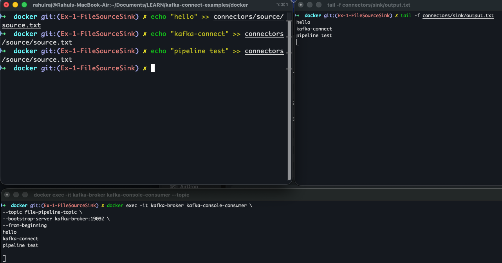

Exercise 1: FileStream Source & Sink Connectors (Kafka Connect)

This exercise demonstrates how to use FileStream Source and FileStream Sink connectors to read data from files and write it to Kafka topics, and then read from Kafka topics and write back to files.
All steps are included so learners can reproduce the setup reliably.

⸻

1. Custom Kafka Connect Dockerfile (With FileStream Connectors)

Create a Dockerfile inside the docker directory:

# Stage 1: fetch jars from Apache Kafka image matching your version
FROM apache/kafka:3.7.0 AS kafka-dist
USER root
ENV FILESTREAM_PLUGIN_DIR=/usr/share/filestream-connectors
RUN mkdir -p ${FILESTREAM_PLUGIN_DIR}
COPY --from=kafka-dist /opt/kafka/libs/connect-file-*.jar ${FILESTREAM_PLUGIN_DIR}/
RUN chmod -R 755 ${FILESTREAM_PLUGIN_DIR} || true
USER appuser

Ensure your Kafka Connect container includes:

CONNECT_PLUGIN_PATH=/usr/share/java,/usr/share/filestream-connectors

⸻

2. Create Source and Sink Files

On the host machine:

mkdir -p connectors/source connectors/sink
touch connectors/source/source.txt
touch connectors/sink/sink.txt
chmod -R 777 connectors

Verify inside Kafka Connect:

docker exec -it kafka-connect ls -l /tmp/source
docker exec -it kafka-connect ls -l /tmp/sink

⸻

3. Create Kafka Topics

Source demo topic:

docker exec -it kafka-broker kafka-topics \
--create --topic file-source-topic \
--bootstrap-server kafka-broker:19092

Sink demo topic:

docker exec -it kafka-broker kafka-topics \
--create --topic file-sink-topic \
--bootstrap-server kafka-broker:19092

List topics:

docker exec -it kafka-broker kafka-topics \
--list --bootstrap-server kafka-broker:19092

⸻

4. Register FileStream Source Connector

Reads from /tmp/source/source.txt and writes to file-source-topic:

curl -X POST http://localhost:8083/connectors \
-H "Content-Type: application/json" \
-d '{
"name": "file-source-connector",
"config": {
"connector.class": "org.apache.kafka.connect.file.FileStreamSourceConnector",
"tasks.max": "1",
"file": "/tmp/source/source.txt",
"topic": "file-source-topic",
"key.converter": "org.apache.kafka.connect.storage.StringConverter",
"value.converter": "org.apache.kafka.connect.storage.StringConverter"
}
}'

Check status:

curl -s localhost:8083/connectors/file-source-connector/status | jq

⸻

5. Register FileStream Sink Connector

Reads from file-sink-topic and writes to /tmp/sink/sink.txt:

curl -X POST http://localhost:8083/connectors \
-H "Content-Type: application/json" \
-d '{
"name": "file-sink-connector",
"config": {
"connector.class": "org.apache.kafka.connect.file.FileStreamSinkConnector",
"tasks.max": "1",
"topics": "file-sink-topic",
"file": "/tmp/sink/sink.txt",
"key.converter": "org.apache.kafka.connect.storage.StringConverter",
"value.converter": "org.apache.kafka.connect.storage.StringConverter"
}
}'

Status:

curl -s localhost:8083/connectors/file-sink-connector/status | jq

⸻

6. Test Source Connector (File → Kafka)

Write lines to file:

echo "hello world" >> connectors/source/source.txt
echo "kafka connect test" >> connectors/source/source.txt

Consume from topic:

docker exec -it kafka-broker kafka-console-consumer \
--topic file-source-topic \
--bootstrap-server kafka-broker:19092 \
--from-beginning

Expected output:

hello world
kafka connect test

⸻

7. Test Sink Connector (Kafka → File)

Produce messages:

docker exec -it kafka-broker kafka-console-producer \
--topic file-sink-topic \
--bootstrap-server kafka-broker:19092

Type:

line-1
line-2
line-3

Verify sink file:

tail -f connectors/sink/sink.txt

Expected:

line-1
line-2
line-3

⸻

8. End-to-End Pipeline Example

Flow:

source.txt → Source Connector → file-pipeline-topic → Sink Connector → output.txt

Create topic:

docker exec -it kafka-broker kafka-topics \
--create --topic file-pipeline-topic \
--bootstrap-server kafka-broker:19092

Register Source:

curl -X POST http://localhost:8083/connectors \
-H "Content-Type: application/json" \
-d '{
"name": "file-pipeline-source",
"config": {
"connector.class": "org.apache.kafka.connect.file.FileStreamSourceConnector",
"tasks.max": "1",
"file": "/tmp/source/source.txt",
"topic": "file-pipeline-topic",
"key.converter": "org.apache.kafka.connect.storage.StringConverter",
"value.converter": "org.apache.kafka.connect.storage.StringConverter"
}
}'

Register Sink:

curl -X POST http://localhost:8083/connectors \
-H "Content-Type: application/json" \
-d '{
"name": "file-pipeline-sink",
"config": {
"connector.class": "org.apache.kafka.connect.file.FileStreamSinkConnector",
"tasks.max": "1",
"topics": "file-pipeline-topic",
"file": "/tmp/sink/output.txt",
"key.converter": "org.apache.kafka.connect.storage.StringConverter",
"value.converter": "org.apache.kafka.connect.storage.StringConverter"
}
}'

Append data:

echo "hello" >> connectors/source/source.txt
echo "kafka-connect" >> connectors/source/source.txt
echo "pipeline test" >> connectors/source/source.txt

Consume / verify:

docker exec -it kafka-broker kafka-console-consumer \
--topic file-pipeline-topic \
--bootstrap-server kafka-broker:19092 \
--from-beginning \
--timeout-ms 10000

tail -f connectors/sink/output.txt

⸻

9. Useful Kafka Connect REST APIs

List connectors:

curl -s localhost:8083/connectors | jq

Get connector config:

curl -s localhost:8083/connectors/<name> | jq

Get status:

curl -s localhost:8083/connectors/<name>/status | jq

Pause:

curl -X PUT localhost:8083/connectors/<name>/pause

Resume:

curl -X PUT localhost:8083/connectors/<name>/resume

Restart connector:

curl -X POST localhost:8083/connectors/<name>/restart

Restart task:

curl -X POST localhost:8083/connectors/<name>/tasks/0/restart

List only source connectors:

curl -s localhost:8083/connectors \
| jq -r '.[]' \
| xargs -I {} curl -s localhost:8083/connectors/{}/ \
| jq 'select(.type == "source") | .name'

⸻

10. Cleanup

curl -X DELETE http://localhost:8083/connectors/file-source-connector
curl -X DELETE http://localhost:8083/connectors/file-sink-connector
curl -X DELETE http://localhost:8083/connectors/file-pipeline-source
curl -X DELETE http://localhost:8083/connectors/file-pipeline-sink
curl -X DELETE http://localhost:8083/connectors/regex-source
curl -X DELETE http://localhost:8083/connectors/regex-sink
curl -X DELETE http://localhost:8083/connectors/mask-sink
curl -X DELETE http://localhost:8083/connectors/partial-mask-sink

Delete topics (optional, if allowed):

docker exec -it kafka-broker kafka-topics --bootstrap-server kafka-broker:19092 --delete --topic file-source-topic || true
docker exec -it kafka-broker kafka-topics --bootstrap-server kafka-broker:19092 --delete --topic file-sink-topic || true
docker exec -it kafka-broker kafka-topics --bootstrap-server kafka-broker:19092 --delete --topic file-pipeline-topic || true
docker exec -it kafka-broker kafka-topics --bootstrap-server kafka-broker:19092 --delete --topic file-raw || true

⸻

11. SMT (Single Message Transforms)

Example 1 — No Transformation (Simple Copy)

docker exec -it kafka-broker kafka-topics \
--create --topic file-raw \
--bootstrap-server kafka-broker:19092

Register source:

curl -X POST http://localhost:8083/connectors \
-H "Content-Type: application/json" \
-d '{
"name": "regex-source",
"config": {
"connector.class": "org.apache.kafka.connect.file.FileStreamSourceConnector",
"tasks.max": "1",
"file": "/tmp/source/source.txt",
"topic": "file-raw",
"key.converter": "org.apache.kafka.connect.storage.StringConverter",
"value.converter": "org.apache.kafka.connect.storage.StringConverter"
}
}'

Register SMT sink:

curl -X POST http://localhost:8083/connectors \
-H "Content-Type: application/json" \
-d '{
"name": "regex-sink",
"config": {
"connector.class": "org.apache.kafka.connect.file.FileStreamSinkConnector",
"tasks.max": "1",
"topics": "file-raw",
"file": "/tmp/sink/regex-output.txt",
"key.converter": "org.apache.kafka.connect.storage.StringConverter",
"value.converter": "org.apache.kafka.connect.storage.StringConverter",
"transforms": "route",
"transforms.route.type": "org.apache.kafka.connect.transforms.RegexRouter",
"transforms.route.regex": "file-raw",
"transforms.route.replacement": "file-processed"
}
}'

Test:

echo "Hello Simple SMT" >> connectors/source/source.txt
echo "It will be copied directly to sink file without any transformations" >> connectors/source/source.txt

tail -f connectors/sink/regex-output.txt

Clean:

curl -X DELETE http://localhost:8083/connectors/regex-sink
curl -X DELETE http://localhost:8083/connectors/regex-source

⸻

Example 2 — Masking (Full-Field Masking)

curl -X POST http://localhost:8083/connectors \
-H "Content-Type: application/json" \
-d '{
"name": "mask-sink",
"config": {
"connector.class": "org.apache.kafka.connect.file.FileStreamSinkConnector",
"tasks.max": "1",
"topics": "file-raw",
"file": "/tmp/sink/mask-output.txt",
"key.converter": "org.apache.kafka.connect.storage.StringConverter",
"value.converter": "org.apache.kafka.connect.storage.StringConverter",
"transforms": "Hoist,Mask",
"transforms.Hoist.type": "org.apache.kafka.connect.transforms.HoistField$Value",
"transforms.Hoist.field": "message",
"transforms.Mask.type": "org.apache.kafka.connect.transforms.MaskField$Value",
"transforms.Mask.fields": "message",
"transforms.Mask.replacement": "*****"
}
}'

Clean:

curl -X DELETE http://localhost:8083/connectors/mask-sink

⸻

Next: Partial Masking (requires installing additional plugins)

