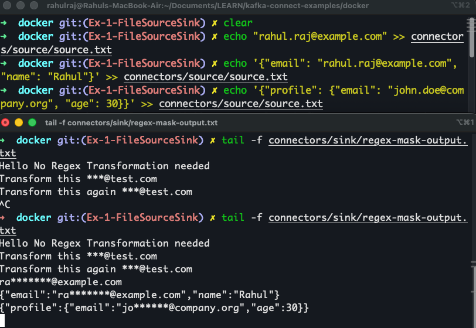

# Exercise 1: FileStream Source & Sink Connectors (Kafka Connect)

This exercise demonstrates how to use Kafka Connect with FileStream Source and Sink connectors to build a local learning and experimentation environment. 
We will learn how to create connectors, send data from files into Kafka, write data back from Kafka to files, apply Single Message Transforms (SMTs), 
and build a custom SMT plugin for partial masking.

All examples run using the provided Docker Compose setup and a custom Kafka Connect Dockerfile.

======================================================================
## 1.	Overview of What This Exercise Covers

This module covers the following topics:
-	Preparing Kafka Connect with a custom Dockerfile.
-	Understanding and using FileStream Source and Sink connectors.
-	Creating topics and validating message flow end-to-end.
-	Applying built-in SMTs such as RegexRouter, HoistField, and MaskField.
-	Building a custom SMT plugin to perform partial masking with regex.
-	Validating and debugging connectors using Kafka Connect REST APIs.
-	Cleaning up connectors and topics.

This exercise is designed as a complete, incremental walkthrough for learners.

======================================================================
## 2. Preparing Kafka Connect (Custom Dockerfile)

Kafka Connect images from Confluent do not include FileStream connectors by default.
The provided Dockerfile:
-	Uses a multi-stage build to extract the FileStream connector jars from Apache Kafka.
-	Copies the custom SMT JAR into the correct plugin directory.
-	Ensures correct permissions.
-	Produces a clean, production-ready Kafka Connect image.

Refer to the Dockerfile under: `kafka-connect-examples/docker/Dockerfile`

======================================================================
## 3. Prepare Files for Source and Sink Connectors

Create folders and files on the host machine, these will be volume mounted to kafka-connect service.

`mkdir -p connectors/source connectors/sink`

`touch connectors/source/source.txt`

`touch connectors/sink/sink.txt`

`chmod -R 777 connectors`

**Validate inside the running kafka-connect container:**

`docker exec -it kafka-connect ls -l /tmp/source`
`docker exec -it kafka-connect ls -l /tmp/sink`

Refer to the docker-compose file under: `kafka-connect-examples/docker/docker-file.yml`

======================================================================
## 4. Create Kafka Topics

**Create source topic:**

```
docker exec -it kafka-broker kafka-topics –create
–topic file-source-topic
–bootstrap-server kafka-broker:19092
```

**Create sink topic:**
```
docker exec -it kafka-broker kafka-topics –create
–topic file-sink-topic
–bootstrap-server kafka-broker:19092
```

**List topics:**
```
docker exec -it kafka-broker kafka-topics –list
–bootstrap-server kafka-broker:19092
```

======================================================================
## 5. Register FileStream Source Connector (File → Kafka)
```
curl -X POST http://localhost:8083/connectors
-H “Content-Type: application/json”
-d ‘{
“name”: “file-source-connector”,
“config”: {
“connector.class”: “org.apache.kafka.connect.file.FileStreamSourceConnector”,
“tasks.max”: “1”,
“file”: “/tmp/source/source.txt”,
“topic”: “file-source-topic”,
“key.converter”: “org.apache.kafka.connect.storage.StringConverter”,
“value.converter”: “org.apache.kafka.connect.storage.StringConverter”
}
}’
```

**Check status:**

`curl -s localhost:8083/connectors/file-source-connector/status | jq`

======================================================================
## 6. Test Source Connector (File → Kafka)

Append lines to the source file:

```
echo “hello world” >> connectors/source/source.txt
echo “kafka connect test” >> connectors/source/source.txt
```

Read from topic:
```
docker exec -it kafka-broker kafka-console-consumer
–topic file-source-topic
–bootstrap-server kafka-broker:19092
–from-beginning
```

Expected:
```
hello world
kafka connect test
```


======================================================================
## 7. Register FileStream Sink Connector (Kafka → File)
```
curl -X POST http://localhost:8083/connectors
-H “Content-Type: application/json”
-d ‘{
“name”: “file-sink-connector”,
“config”: {
“connector.class”: “org.apache.kafka.connect.file.FileStreamSinkConnector”,
“tasks.max”: “1”,
“topics”: “file-sink-topic”,
“file”: “/tmp/sink/sink.txt”,
“key.converter”: “org.apache.kafka.connect.storage.StringConverter”,
“value.converter”: “org.apache.kafka.connect.storage.StringConverter”
}
}’
```

**Check status:**

`curl -s localhost:8083/connectors/file-sink-connector/status | jq`

======================================================================
## 8. Test Sink Connector (Kafka → File)

Produce messages:
```
docker exec -it kafka-broker kafka-console-producer
–topic file-sink-topic
–bootstrap-server kafka-broker:19092
```

Type:
```
line-1
line-2
line-3
```

**Verify output:**

`tail -f connectors/sink/sink.txt`


======================================================================
## 9. End-to-End Pipeline Example

**Data flow:**

```
source.txt → Source Connector → file-pipeline-topic → Sink Connector → output.txt
```

**Create topic:**
```
docker exec -it kafka-broker kafka-topics \
--create --topic file-pipeline-topic \
--bootstrap-server kafka-broker:19092
```

**Register Source:**
```
curl -X POST http://localhost:8083/connectors \
-H "Content-Type: application/json" \
-d '{
"name": "file-pipeline-source",
"config": {
"connector.class": "org.apache.kafka.connect.file.FileStreamSourceConnector",
"tasks.max": "1",
"file": "/tmp/source/source.txt",
"topic": "file-pipeline-topic",
"key.converter": "org.apache.kafka.connect.storage.StringConverter",
"value.converter": "org.apache.kafka.connect.storage.StringConverter"
}
}'
```

**Check Status:**

`curl -s localhost:8083/connectors/file-pipeline-source/status | jq`

**Register Sink:**

```
curl -X POST http://localhost:8083/connectors \
-H "Content-Type: application/json" \
-d '{
"name": "file-pipeline-sink",
"config": {
"connector.class": "org.apache.kafka.connect.file.FileStreamSinkConnector",
"tasks.max": "1",
"topics": "file-pipeline-topic",
"file": "/tmp/sink/output.txt",
"key.converter": "org.apache.kafka.connect.storage.StringConverter",
"value.converter": "org.apache.kafka.connect.storage.StringConverter"
}
}'
```

**Check Status:**

`curl -s localhost:8083/connectors/file-pipeline-sink/status | jq`

**Append data:**

```
echo "hello" >> connectors/source/source.txt
echo "kafka-connect" >> connectors/source/source.txt
echo "pipeline test" >> connectors/source/source.txt
```

Consume / verify:
```
docker exec -it kafka-broker kafka-console-consumer \
--topic file-pipeline-topic \
--bootstrap-server kafka-broker:19092 \
--from-beginning \
--timeout-ms 10000
```

`tail -f connectors/sink/output.txt`


======================================================================
## 10. Useful Kafka Connect REST APIs

**List connectors:**
`curl -s localhost:8083/connectors | jq`

**Connector config:**
`curl -s localhost:8083/connectors/ | jq`

**Status:**
`curl -s localhost:8083/connectors//status | jq`

**Pause / Resume:**
`curl -X PUT localhost:8083/connectors//pause
curl -X PUT localhost:8083/connectors//resume`

**Restart:**
`curl -X POST localhost:8083/connectors//restart`

**List only source connectors:**
```
curl -s localhost:8083/connectors
| jq -r ‘.[]’
| xargs -I {} curl -s localhost:8083/connectors/{}/
| jq ‘select(.type == “source”) | .name’
```

======================================================================
## 11. Cleanup Commands

**Remove connectors:**

`curl -X DELETE http://localhost:8083/connectors/file-source-connector`

`curl -X DELETE http://localhost:8083/connectors/file-sink-connector`

`curl -X DELETE http://localhost:8083/connectors/file-pipeline-source`

`curl -X DELETE http://localhost:8083/connectors/file-pipeline-sink`

`curl -X DELETE http://localhost:8083/connectors/regex-source`

`curl -X DELETE http://localhost:8083/connectors/regex-sink`

`curl -X DELETE http://localhost:8083/connectors/mask-sink`

`curl -X DELETE http://localhost:8083/connectors/partial-mask-sink`


Delete topics (optional):

`docker exec -it kafka-broker kafka-topics -–bootstrap-server kafka-broker:19092 -–delete -–topic TOPIC_NAME`

======================================================================
## 12. SMT (Single Message Transforms)

⸻

**Example 1 — RegexRouter (Simple SMT, No Transformation)**

Demonstrates routing messages to a new topic based on a pattern.
It helps us understand that SMTs are simple, per-record transformations.

Create topic (we will be using same topic for all SMT examples): 
```
docker exec -it kafka-broker kafka-topics \
--create --topic file-raw \
--bootstrap-server kafka-broker:19092
```

**Register source** (we will be using this same source connector for all SMT examples):

```
curl -X POST http://localhost:8083/connectors \
-H "Content-Type: application/json" \
-d '{
"name": "regex-source",
"config": {
"connector.class": "org.apache.kafka.connect.file.FileStreamSourceConnector",
"tasks.max": "1",
"file": "/tmp/source/source.txt",
"topic": "file-raw",
"key.converter": "org.apache.kafka.connect.storage.StringConverter",
"value.converter": "org.apache.kafka.connect.storage.StringConverter"
}
}'
```

**Register SMT sink:**

```
curl -X POST http://localhost:8083/connectors \
-H "Content-Type: application/json" \
-d '{
"name": "regex-sink",
"config": {
"connector.class": "org.apache.kafka.connect.file.FileStreamSinkConnector",
"tasks.max": "1",
"topics": "file-raw",
"file": "/tmp/sink/regex-output.txt",
"key.converter": "org.apache.kafka.connect.storage.StringConverter",
"value.converter": "org.apache.kafka.connect.storage.StringConverter",
"transforms": "route",
"transforms.route.type": "org.apache.kafka.connect.transforms.RegexRouter",
"transforms.route.regex": "file-raw",
"transforms.route.replacement": "file-processed"
}
}'
```

**Test:**

```
echo "Hello Simple SMT" >> connectors/source/source.txt
echo "It will be copied directly to sink file without any transformations" >> connectors/source/source.txt
```

`tail -f connectors/sink/regex-output.txt`


**Clean:**

`curl -X DELETE http://localhost:8083/connectors/regex-sink`

⸻

**Example 2 — MaskField and HoistField (Full Message Masking)**

Used to wrap plain string messages into JSON using HoistField and then mask fields using MaskField.

```
curl -X POST http://localhost:8083/connectors \
-H "Content-Type: application/json" \
-d '{
"name": "mask-sink",
"config": {
"connector.class": "org.apache.kafka.connect.file.FileStreamSinkConnector",
"tasks.max": "1",
"topics": "file-raw",
"file": "/tmp/sink/mask-output.txt",
"key.converter": "org.apache.kafka.connect.storage.StringConverter",
"value.converter": "org.apache.kafka.connect.storage.StringConverter",
"transforms": "Hoist,Mask",
"transforms.Hoist.type": "org.apache.kafka.connect.transforms.HoistField$Value",
"transforms.Hoist.field": "message",
"transforms.Mask.type": "org.apache.kafka.connect.transforms.MaskField$Value",
"transforms.Mask.fields": "message",
"transforms.Mask.replacement": "*****"
}
}'
```


Clean:

curl -X DELETE http://localhost:8083/connectors/mask-sink


======================================================================
## 13. Partial Masking Using a Custom SMT Plugin

Kafka Connect does not support partial masking (e.g., masking part of an email address) via built-in SMTs.
Therefore, this exercise includes a custom SMT implemented in Java. Refer a very minimal SMT Plugin at kafka-connect-examples/java/utilities/transforms module.
Refer next section for details on how to create custom SMT.

Capabilities of the custom SMT:
-	Handles plain strings
-	Handles JSON strings
-	Handles JSON objects
-	Handles nested JSON structures
-	Applies regex-based partial masking

Example configuration:
```
“transforms”: “MaskEmail”
“transforms.MaskEmail.type”: “com.rrp.connect.RegexMask$Value”
“transforms.MaskEmail.regex”: “(?<=.{2}).(?=[^@]@)”
“transforms.MaskEmail.replacement”: “”
```

**Sample input:**
`{“email”: “rahul.raj@example.com”, “name”: “Rahul”}`

**Sample output:**
`{“email”: “ra*******@example.com”, “name”: “Rahul”}`

**Register Sink Connector:** 

```
curl -s -X POST http://localhost:8083/connectors \
-H "Content-Type: application/json" \
-d '{
"name": "file-mask-sink",
"config": {
"connector.class": "org.apache.kafka.connect.file.FileStreamSinkConnector",
"tasks.max": "1",
"topics": "file-raw",
"file": "/tmp/sink/regex-mask-output.txt",

    "key.converter": "org.apache.kafka.connect.storage.StringConverter",

    "value.converter": "org.apache.kafka.connect.storage.StringConverter",
    "value.converter.schemas.enable": "false",

    "transforms": "MaskEmail",
    "transforms.MaskEmail.type": "com.rrp.connect.RegexMask$Value",

    "transforms.MaskEmail.regex": "(?<=.{2}).(?=[^@]*@)",
    "transforms.MaskEmail.replacement": "*"
}
}'
```

**TEST:**
WRITE to Source File:
```
echo "Hello No Regex Transformation needed" >> connectors/source/source.txt
echo "Transform this rahul@test.com" >> connectors/source/source.txt
echo "rahul.raj@example.com" >> connectors/source/source.txt
echo '{"email": "rahul.raj@example.com", "name": "Rahul"}' >> connectors/source/source.txt
echo '{"profile": {"email": "john.doe@company.org", "age": 30}}' >> connectors/source/source.txt
```

READ from Sink File:
```
tail -f connectors/sink/regex-mask-output.txt
Hello No Regex Transformation needed
Transform this ***@test.com
Transform this again ***@test.com
ra*******@example.com
{"email":"ra*******@example.com","name":"Rahul"}
{"profile":{"email":"jo******@company.org","age":30}}
```



**Cleanup:**

`curl -X DELETE http://localhost:8083/connectors/regex-source`

`curl -X DELETE http://localhost:8083/connectors/file-mask-sink`

======================================================================
## Appendix — How to Create a Custom SMT (Single Message Transform)

This appendix explains how to build our own Kafka Connect SMT (like the RegexMask transform we implemented).

⸻

A. Minimum Requirements for Any Custom SMT

A custom SMT must include:

1. A Java class implementing: org.apache.kafka.connect.transforms.Transformation<R>

2. A JAR file containing the compiled classes

Example structure:
```
transforms-1.0-SNAPSHOT.jar
├── com/rrp/connect/RegexMask.class
├── com/rrp/connect/RegexMask$Value.class
└── META-INF/services/org.apache.kafka.connect.transforms.Transformation
```

3. Mandatory META-INF Service Loader File

Path inside the JAR:

`META-INF/services/org.apache.kafka.connect.transforms.Transformation`

Content:

`com.rrp.connect.RegexMask`

Kafka Connect will not discover the SMT without this file.

⸻

B. Plugin Directory Requirements

Kafka Connect requires each plugin in its own directory:

`/usr/share/java/regex-mask/transforms-1.0-SNAPSHOT.jar`

Update the compose file:

`CONNECT_PLUGIN_PATH: "/usr/share/java,/usr/share/filestream-connectors,/usr/share/java/regex-mask"`

Plugins are loaded only on startup, so rebuilding the container is required.

⸻

C. How to Verify That Kafka Connect Loaded our SMT

1. Check Connect Logs

docker logs kafka-connect | grep -i regex

We should see:

INFO Added plugin 'com.rrp.connect.RegexMask'
INFO Added plugin 'com.rrp.connect.RegexMask$Value'

If we see Class not found, discovery failed.

⸻

2. Validate Using Connector Config Endpoint
```
curl -s -X PUT http://localhost:8083/connector-plugins/org.apache.kafka.connect.file.FileStreamSinkConnector/config/validate \
-H "Content-Type: application/json" \
-d '{
"connector.class":"org.apache.kafka.connect.file.FileStreamSinkConnector",
"transforms":"mask",
"transforms.mask.type":"com.rrp.connect.RegexMask$Value"
}' | jq
```

If working, _validation shows no errors._

If failing: _Class com.rrp.connect.RegexMask$Value could not be found_


⸻

3. Optional Plugin List Check

Sometimes SMTs show up:

`curl -s http://localhost:8083/connector-plugins | jq`

Look for: "com.rrp.connect.RegexMask"


⸻

D. Common Errors and Fixes

| Issue                              | Cause                                         | Fix                                                   |
|:-----------------------------------|:----------------------------------------------|:------------------------------------------------------|
| Class not found	                   | Missing META-INF file                         | 	Add ServiceLoader file                               |
| Plugin not visible                 | JAR not in isolated directory                 | Put JAR under /usr/share/java/regex-mask              |
| SMT ignored after rebuild          | Compose cached image                          | Run docker-compose down -v && docker-compose up --build |
| “Compiled with newer Java version” | JAR built with Java 17+, Connect runs Java 17 | Build with Java 11 or 17                              |


⸻

E. Minimal Checklist for Custom SMT
-	Java class implementing Transformation<R>
-	META-INF service loader file exists
-	JAR placed inside its own plugin folder
-	Plugin directory added to CONNECT_PLUGIN_PATH
-	Kafka Connect restarted
-	Verified through logs + validate API

======================================================================

Summary

By completing this exercise, learners will understand:
-	How Kafka Connect works end-to-end.
-	How to build and run FileStream Source and Sink connectors.
-	How to apply built-in SMTs for common transformations.
-	How to develop and deploy a custom SMT plugin.
-	How to process plain text, structured text, JSON, and nested JSON.
-	How to validate plugin loading and debug connector behavior.
-	How to clean up connectors and topics.


