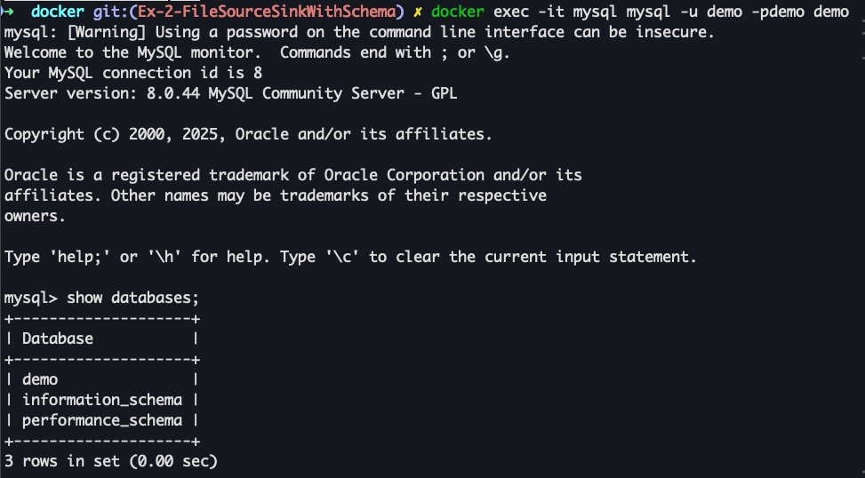
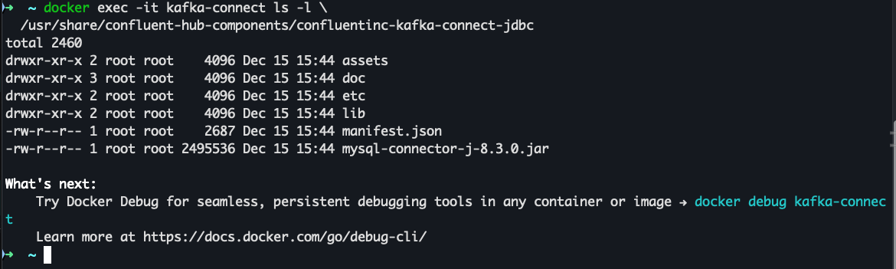
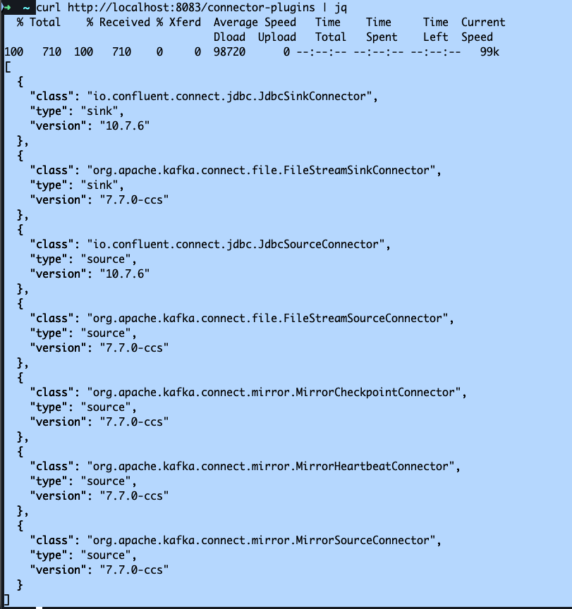
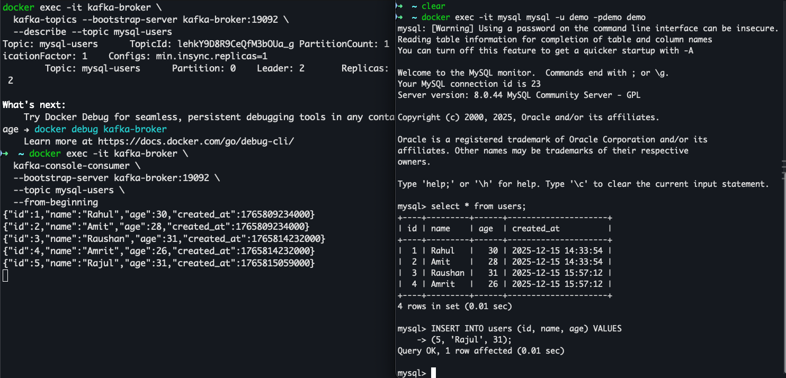
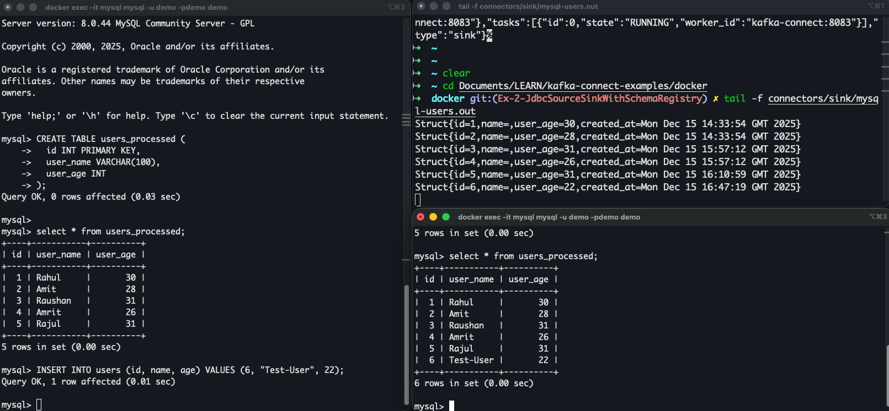
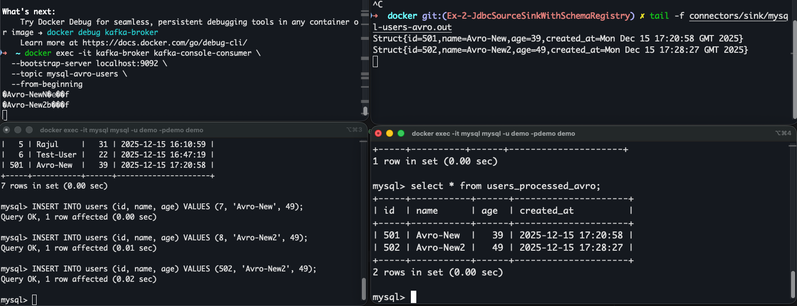

Setup Needed: 
1. SchemaRegistry Setup

Schema Registry needs only:
- 	Kafka bootstrap servers
-	A group ID
-	A topic to store schemas (created automatically)
-	REST port

Add SchemaRegistry service in docker-compose.

Bring the Infra Up:
```
docker-compose up -d

docker ps
```

Validate Schema Registry
Check health
```
curl http://localhost:8081/subjects
```

Verify _schemas topic exists
```
docker exec -it kafka-broker \
  kafka-topics --bootstrap-server kafka-broker:19092 --list
```
_schemas should be there in the list of topics.

---
2. MySQL Setup 

Add mysql service in docker-compose.yaml file.

Start MySQL: 
`docker-compose up -d mysql`

Verify: 
`docker exec -it mysql mysql -u demo -pdemo demo`

This should start a prompt of MySQL like this, hit `Ctrl + z` to exit.


**Create sample table**
```
CREATE TABLE users (
  id INT PRIMARY KEY,
  name VARCHAR(255),
  age INT,
  created_at TIMESTAMP DEFAULT CURRENT_TIMESTAMP
);

INSERT INTO users (id, name, age) VALUES
(1, 'Rahul', 30),
(2, 'Amit', 28);
```


3. JDBC Driver in custom-kafka-connect 

Update Dockerfile to download `kafka-connect-jdbc` and `mysql-connector` jars.

Rebuild kafka-connect: 
```
docker-compose stop kafka-connect
docker-compose build --no-cache kafka-connect
docker-compose up -d kafka-connect
```

Verify the jars are downloaded and properly placed inside pod:


Verify Connector Plugins are loaded: 
```
curl http://localhost:8083/connector-plugins | jq
```


---
## Example 1 - JDBC Source/Sink (MySQL) + Schema Registry
What this example will demonstrate
-	Structured source (Struct + Schema)
-	Schema Registry actually registering subjects
-	Strict type enforcement
-	End-to-end: MySQL → Kafka → MySQL/File
-	Formats we will cover:
1.	JSON Schema
2.	Avro
3.	Protobuf

**canonical Kafka Connect + Schema Registry pipeline**
```
MySQL table
    ↓ (JDBC Source)
Kafka Connect (Struct + Schema)
    ↓ (Converter)
Kafka topic (schema-backed)
    ↓ (Sink)
MySQL / File
```


### i) Configure Kafka Connect for Schema Registry (JSON Schema)
Update Kafka Connect Service:

```
CONNECT_KEY_CONVERTER: "org.apache.kafka.connect.storage.StringConverter"

CONNECT_VALUE_CONVERTER: "io.confluent.connect.json.JsonSchemaConverter"
CONNECT_VALUE_CONVERTER_SCHEMA_REGISTRY_URL: "http://schema-registry:8081"

CONNECT_VALUE_CONVERTER_AUTO_REGISTER_SCHEMAS: "true"
CONNECT_VALUE_CONVERTER_USE_LATEST_VERSION: "true"
```

### ii) Restart Kafka Connect
```
docker-compose up -d --force-recreate kafka-connect
```

validate: 
```
curl http://localhost:8083/
```

### iii) JDBC Source Connector (JSON Schema)

We are going to use incrementing mode in JDBC Source Connector in this example,
In `mode=incrementing`, the connector tracks an offset equal to the largest value seen in the incrementing column.
- On the very first poll, if no offset exists yet, it discovers the current maximum and uses that as its starting point (effectively saying “only ingest rows that appear after now”).
  The query becomes `SELECT * FROM users WHERE id > 2`;
So with existing
- Table has `id = 1, 2` before the connector ever runs.
- At startup in pure `incrementing-only` mode, it establishes `last_seen_id = 2`.
- Effective query is `id > 2`, so rows 1 and 2 are never emitted.
This mode is designed for append‑only streams where you are okay with “start from now” semantics, not for historical backfill.

**JDBC Source Connector Config and registration**
```
curl -X POST http://localhost:8083/connectors \
  -H "Content-Type: application/json" \
  -d '{
    "name": "mysql-users-source",
    "config": {
      "connector.class": "io.confluent.connect.jdbc.JdbcSourceConnector",
      "tasks.max": "1",

      "connection.url": "jdbc:mysql://mysql:3306/demo",
      "connection.user": "demo",
      "connection.password": "demo",

      "table.whitelist": "users",
      "mode": "incrementing",
      "incrementing.column.name": "id",

      "topic.prefix": "mysql-",
      
      "topic.creation.enable": "true",
      "topic.creation.default.partitions": "1",
      "topic.creation.default.replication.factor": "1"
    }
  }'
```


What it will do under the hood is that: 
- Register this Source Connector
- Register the schema
- Create topic

**Verify Connector registration**
```
curl http://localhost:8083/connectors
```
Expected:
["mysql-users-source"]

Check status of Connector: 
```
curl http://localhost:8083/connectors/mysql-users-source/status
```
Expected: `"state": "RUNNING"`

Kafka Connect creates topics and registers schemas only when it actually produces records. Connector registration alone does nothing to Kafka or Schema Registry.
A JDBC Source connector may start successfully without creating a Kafka topic or registering a schema if no new rows qualify for ingestion and/or if a Schema Registry–backed converter is not configured. 
Topics and schemas are created lazily only when records are produced.
To avoid these issues, In production, teams do NOT rely on JDBC Source alone when tables already contain data.
They use CDC (Debezium), often combined with a one-time bulk load, depending on the use case.

### v) Verify Schema Registration
```
curl http://localhost:8081/subjects
```
Expected:
["mysql-users-value"]


Check Schema: 
```
curl http://localhost:8081/subjects/mysql-users-value/versions/latest
```


**Test and Demo:** 

Read from topic: 
```
docker exec -it kafka-broker kafka-console-consumer \
  --bootstrap-server kafka-broker:19092 \
  --topic mysql-users \
  --from-beginning
```

Insert into table:

```
docker exec -it mysql mysql -u demo -pdemo demo

INSERT INTO users (id, name, age) VALUES
(3, 'Raushan', 31),
(4, 'Amrit', 26);
```




Sink Connectors: 

```
MySQL (users table)
        |
        |  JDBC Source Connector
        v
Kafka topic: mysql-users
        |
        +---------------------------+
        |                           |
File Sink Connector        JDBC Sink Connector
(users.json)               (users_processed table)
        |
   SMTs applied              SMTs applied
```

Ex 1: File Sink Connector (with Transformation)
Write Kafka records to a file after masking / renaming fields.

File Sink config:
```
curl -X POST http://localhost:8083/connectors \
  -H "Content-Type: application/json" \
  -d '{
    "name": "mysql-users-file-sink",
    "config": {
      "connector.class": "org.apache.kafka.connect.file.FileStreamSinkConnector",
      "tasks.max": "1",

      "topics": "mysql-users",
      "file": "/tmp/sink/mysql-users.out",

      "key.converter": "org.apache.kafka.connect.storage.StringConverter",

      "value.converter": "io.confluent.connect.json.JsonSchemaConverter",
      "value.converter.schema.registry.url": "http://schema-registry:8081",

      "transforms": "MaskName,RenameField",

      "transforms.MaskName.type": "org.apache.kafka.connect.transforms.MaskField$Value",
      "transforms.MaskName.fields": "name",

      "transforms.RenameField.type": "org.apache.kafka.connect.transforms.ReplaceField$Value",
      "transforms.RenameField.renames": "age:user_age"
    }
  }'
```

```
curl http://localhost:8083/connectors

curl http://localhost:8083/connectors/mysql-users-file-sink/status
```
Ex 2: JDBC Sink Connector (Kafka → MySQL) (with transformation)
Write transformed Kafka records into another MySQL table.
As part of transformation, we will remove created_at field from source table and then write the rows into sink table.

Create Target Table:
```
docker exec -it mysql mysql -u demo -pdemo demo

CREATE TABLE users_processed (
  id INT PRIMARY KEY,
  user_name VARCHAR(100),
  user_age INT
);
```

JDBC Sink config
```
curl -X POST http://localhost:8083/connectors \
  -H "Content-Type: application/json" \
  -d '{
    "name": "mysql-users-jdbc-sink",
    "config": {
      "connector.class": "io.confluent.connect.jdbc.JdbcSinkConnector",
      "tasks.max": "1",

      "topics": "mysql-users",

      "connection.url": "jdbc:mysql://mysql:3306/demo",
      "connection.user": "demo",
      "connection.password": "demo",

      "auto.create": "false",
      "auto.evolve": "false",
      "insert.mode": "upsert",
      "pk.mode": "record_value",
      "pk.fields": "id",

      "table.name.format": "users_processed",
      
      "key.converter": "org.apache.kafka.connect.storage.StringConverter",

      "value.converter": "io.confluent.connect.json.JsonSchemaConverter",
      "value.converter.schema.registry.url": "http://schema-registry:8081",

      "transforms": "Rename,DropField",

      "transforms.Rename.type": "org.apache.kafka.connect.transforms.ReplaceField$Value",
      "transforms.Rename.renames": "name:user_name,age:user_age",

      "transforms.DropField.type": "org.apache.kafka.connect.transforms.ReplaceField$Value",
      "transforms.DropField.blacklist": "created_at"
    }
  }'
```


```
curl http://localhost:8083/connectors

curl http://localhost:8083/connectors/mysql-users-jdbc-sink/status
```

End to End test for Source to Sink using JSON Schema:



Cleanup required for next example:
```
curl -X DELETE http://localhost:8083/connectors/mysql-users-source
curl -X DELETE http://localhost:8083/connectors/mysql-users-file-sink
curl -X DELETE http://localhost:8083/connectors/mysql-users-jdbc-sink

Soft Delete Subject: 
curl -X DELETE http://localhost:8081/subjects/mysql-users-value

curl http://localhost:8081/subjects

Hard Delete Subject:

curl -X DELETE "http://localhost:8081/subjects/mysql-users-value?permanent=true"
```

---

### i) Configure Kafka Connect for Schema Registry (AVRO Schema)
Avro schemas are stricter and more compact than JSON Schema.

JDBC Source (Avro)
```
curl -X POST http://localhost:8083/connectors \
  -H "Content-Type: application/json" \
  -d '{
    "name": "mysql-users-source-avro",
    "config": {
      "connector.class": "io.confluent.connect.jdbc.JdbcSourceConnector",
      "tasks.max": "1",

      "connection.url": "jdbc:mysql://mysql:3306/demo",
      "connection.user": "demo",
      "connection.password": "demo",

      "table.whitelist": "users",
      "mode": "incrementing",
      "incrementing.column.name": "id",

      "topic.prefix": "mysql-avro-",

      "topic.creation.enable": "true",
      "topic.creation.default.partitions": "1",
      "topic.creation.default.replication.factor": "1",

      "key.converter": "org.apache.kafka.connect.storage.StringConverter",

      "value.converter": "io.confluent.connect.avro.AvroConverter",
      "value.converter.schema.registry.url": "http://schema-registry:8081"
    }
  }'
```

Check status
```
curl http://localhost:8083/connectors/mysql-users-source-avro/status
```

Expected result
-	Topic: mysql-avro-users
-	Subject: mysql-avro-users-value (Avro this time)

Verify Avro schema in Schema Registry
```
curl http://localhost:8081/subjects/mysql-avro-users-value/versions/latest
```

Things to notice:
What to notice
- Schema type = Avro
- Fields are strongly typed
- Nullable fields represented via unions

```
curl http://localhost:8081/subjects

```
Expected:
["mysql-avro-users-value"]

Read from topic:
```
docker exec -it kafka-broker kafka-console-consumer \
  --bootstrap-server kafka-broker:19092 \
  --topic mysql-avro-users \
  --from-beginning
```

Sidenote: 
This reading from topic might fail as well depends on how the connector API behaves meaning it is possible that till the 
time a new row is inserted in the source table, this topic will not be created by connector. So its recommended to insert 
at-least one new row in the source table after registering this source connector. From that row, this source will pick and accordingly the sink connector will work as well.

File Sink with Avro (no format mismatch)
```
curl -X POST http://localhost:8083/connectors \
  -H "Content-Type: application/json" \
  -d '{
    "name": "mysql-users-file-sink-avro",
    "config": {
      "connector.class": "org.apache.kafka.connect.file.FileStreamSinkConnector",
      "tasks.max": "1",

      "topics": "mysql-avro-users",
      "file": "/tmp/sink/mysql-users-avro.out",

      "key.converter": "org.apache.kafka.connect.storage.StringConverter",

      "value.converter": "io.confluent.connect.avro.AvroConverter",
      "value.converter.schema.registry.url": "http://schema-registry:8081"
    }
  }'
```

JDBC Sink with Avro (minimal, no SMTs)

Create a new sink table

```
CREATE TABLE users_processed_avro (
  id INT PRIMARY KEY,
  name VARCHAR(100),
  age INT,
  created_at TIMESTAMP
);
```

JDBC Sink (Avro)

```
curl -X POST http://localhost:8083/connectors \
  -H "Content-Type: application/json" \
  -d '{
    "name": "mysql-users-jdbc-sink-avro",
    "config": {
      "connector.class": "io.confluent.connect.jdbc.JdbcSinkConnector",
      "tasks.max": "1",

      "topics": "mysql-avro-users",

      "connection.url": "jdbc:mysql://mysql:3306/demo",
      "connection.user": "demo",
      "connection.password": "demo",

      "auto.create": "false",
      "auto.evolve": "false",

      "insert.mode": "upsert",
      "pk.mode": "record_value",
      "pk.fields": "id",

      "table.name.format": "users_processed_avro",

      "key.converter": "org.apache.kafka.connect.storage.StringConverter",

      "value.converter": "io.confluent.connect.avro.AvroConverter",
      "value.converter.schema.registry.url": "http://schema-registry:8081"
    }
  }'
```

```
curl http://localhost:8083/connectors/mysql-users-jdbc-sink-avro/status
```
End to End Demo: 


Note: 
In this demo, we inserted, 4 records:
```
INSERT INTO users (id, name, age) VALUES (501, 'Avro-New', 39);
INSERT INTO users (id, name, age) VALUES (7, 'Avro-New', 49);
INSERT INTO users (id, name, age) VALUES (8, 'Avro-New2', 49);
INSERT INTO users (id, name, age) VALUES (502, 'Avro-New2', 49);
```

Only id=501 and id=502 rows were picked up by connector because we are using 
```
mode=incrementing
incrementing.column.name=id
```
Kafka Connect JDBC Source maintains an offset like this: last_seen_id = MAX(id) that was successfully produced.
So once it processed id=501 it ignored id=7 and id=8 rows and then processed id=502 row.

Things to know:
- Kafka topic → binary Avro
- File Sink / JDBC Sink → readable values
- Console consumer → unreadable binary

Cleanup: 
```
curl -X DELETE http://localhost:8083/connectors/mysql-users-source-avro
curl -X DELETE http://localhost:8083/connectors/mysql-users-file-sink-avro
curl -X DELETE http://localhost:8083/connectors/mysql-users-jdbc-sink-avro


Soft Delete Subject: 
curl -X DELETE http://localhost:8081/subjects/mysql-users-value

curl http://localhost:8081/subjects

Hard Delete Subject:

curl -X DELETE "http://localhost:8081/subjects/mysql-users-value?permanent=true"
  
```
Important Note: JDBC Source Initial Read Behavior

The JDBC Source connector does not provide a guaranteed snapshot of existing data in a table.

Even when a JDBC Source connector starts with no previously stored offsets, it may initialize its starting position to the current maximum value of the incrementing column (for example, id) and only emit new rows inserted after startup.

As a result:
- Existing rows present in the table may be skipped
- Topic creation and schema registration may occur only when the first new qualifying row is inserted
- This behavior is independent of the serialization format (JSON Schema, Avro, Protobuf)

This is a design choice of the JDBC Source connector, which is optimized for forward polling, not for historical backfills or change data capture.

For use cases that require:
- A reliable initial snapshot
- Continuous capture of inserts, updates, and deletes
- Transactionally consistent event streams

a CDC-based solution (e.g., Debezium) should be used instead of JDBC Source.

## JSON Schema Converter

Important Limitation (JSON + FileStreamSource)

FileStreamSourceConnector emits each line as a String, not a structured JSON object.
As a result:
- Schema Registry cannot enforce JSON field validation
- JSON Schema validation does not work with this connector

Schema Registry requires a structured source (JDBC, Debezium, REST, or custom connector), we will cover this later in upcoming exercises.


---

Mental Model to build:
- Kafka stores bytes.
- Schema Registry stores contracts.
- Converters enforce correctness.

Use of FileStreamConnectors is just for learning purpose, for Production usage use something which provides more control as FileStreamConnectors often misses bulk data read or parsing the data properly.