## Fundamental
## 1. What is CDC (Change Data Capture)?

**The core problem CDC solves**

Traditional database integrations ask: “What is the current state of the table?”

CDC asks a different question: “What exactly changed, in what order, and why?”

_CDC captures changes, not snapshots._ CDC does not query tables rather it reads the DB's own change log.

Changes include:
- INSERT
- UPDATE
- DELETE
- schema changes

And crucially:
- In the exact order they happened
- With transaction boundaries
- Without polling the table
- Near real-time
- Very low load on DB

## 2. How CDC works internally 
Every serious database maintains a write-ahead log:

For ex:

| Database   | Log |  
|------------|-----|  
| MySQL      | binlog |  
| Postgres   | WAL |  
| Oracle     | redo logs |  
| SQL Server | transaction log |

CDC tools:
- Attach to this log
- Parse changes
- Reconstruct row-level events

This means:
- No table scans
- No missed updates
- No race conditions

## 3. Where Debezium fits

Debezium is:
- A CDC engine
- Implemented as Kafka Connect **source** connectors
- Log-based (not polling)
- Schema-aware
- Built for Kafka

Debezium’s job: “Turn database changes into a reliable event stream.”

**What Debezium produces** 
- Debezium does not emit plain rows.
- It emits events with context.

Conceptual shape (simplified):
```
{
  "before": { ... },
  "after": { ... },
  "source": {
    "db": "demo",
    "table": "users",
    "lsn": "...",
    "ts_ms": 123456
  },
  "op": "c",
  "ts_ms": 123456
}
```
This is called an envelope, and it gives great sort of information:
- You know what changed
- You know where it came from
- You know how it changed

## 4. Snapshot + streaming 
When Debezium starts:

**Phase 1: Snapshot**
- Reads all existing rows once
- Emits them as op = r (read)
- Guarantees consistency

**Phase 2: Streaming**
- Switches to binlog
- Emits: 
i) c → insert
ii) u → update
iii) d → delete

---
## Setup 
MySQL requirements for CDC:

Debezium reads MySQL binlog, not tables.
So MySQL must be configured correctly.

**Required MySQL settings**
```
server-id=1             # MySQL replication identity
log-bin=mysql-bin       # enables binlog
binlog-format=ROW       # row-level changes
binlog-row-image=FULL   # full before/after images
```
### 1. Update MySQL Service in docker-compose.


**Recreate and restart MySQL Service**
```
docker-compose stop mysql
docker-compose build --no-cache mysql
docker-compose up -d mysql
```

### 2. Validation

Enter MySQL Service and Verify binlog is enabled
```
# for administrative setup, login using root user
docker exec -it mysql mysql -uroot -proot

SHOW VARIABLES LIKE 'log_bin';

SHOW VARIABLES LIKE 'binlog_format';
```


### 3. Create Debezium user & grant permissions

Debezium needs replication-level privileges.
Why these permissions:
- REPLICATION SLAVE / CLIENT → read binlog
- SELECT → snapshot phase
- RELOAD → binlog metadata
- SHOW DATABASES → schema discovery

```
CREATE USER 'debezium'@'%' IDENTIFIED BY 'dbz';

GRANT SELECT, RELOAD, SHOW DATABASES, REPLICATION SLAVE, REPLICATION CLIENT ON *.* TO 'debezium'@'%';

FLUSH PRIVILEGES;
```
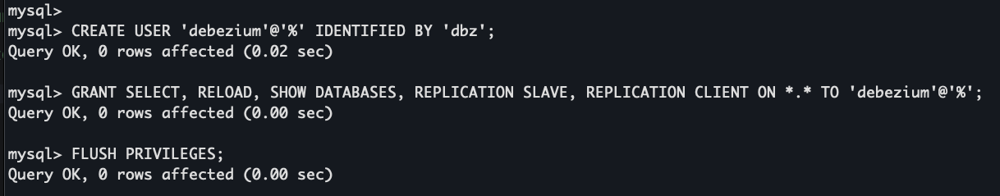


### 4. Install Debezium MySQL connector plugin
Debezium runs inside Kafka Connect.

**Update the Kafka Connect Dockerfile**
```
RUN confluent-hub install --no-prompt debezium/debezium-connector-mysql:2.6.1
```

**Rebuild and Restart kafka-connect service**
```
docker-compose stop kafka-connect
docker-compose build --no-cache kafka-connect
docker-compose up -d kafka-connect
```

**Verify Debezium plugin is loaded**
```
curl http://localhost:8083/connector-plugins | jq
```

Expected
```
{
  "class": "io.debezium.connector.mysql.MySqlConnector",
  "type": "source",
  "version": "3.1.2.Final"
}
```
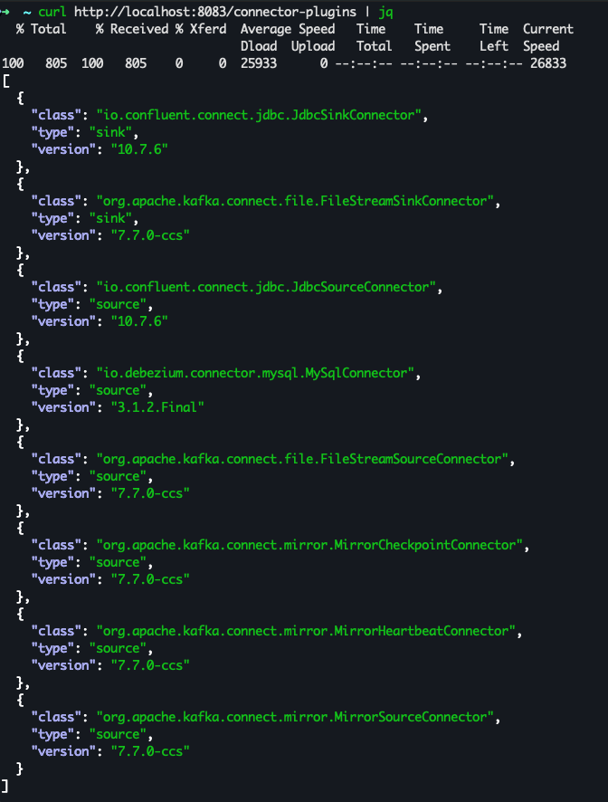

### 5. Setup Redpanda Console for Kafka-UI Access
We need to setup some UI to see messages properly from kafka topics if those are Avro serialized.
In this example, we will setup Redpanda Console for this use case and will enable and configure SchemaRegistry in that so that it can properly parse the messages in topic and display.

Create Config file for Redpanda:
```
kafka:
  brokers:
    - kafka-broker:19092

schemaRegistry:
  enabled: true
  urls:
    - http://schema-registry:8081
```

And then add redpanda-console service in docker-compose file and start the service.

### 6. Validate Schema Registry is reachable
```
curl http://localhost:8081/subjects
```

---

## Examples – CDC with Debezium (MySQL)

This example doc has been updated as in my first trial I created source connector first and 
then created sink which did not pick the snapshot records from the source topic and 
I learnt that it is preferred to create sink connectors first and then the source connector.

So I second iteration of test and created sink connectors first and then source connector which is documented here.

### Ex 1. Single Table → Multiple Sink (Fan-Out architecture pattern)

In this example, we will cover following things: 
- We will have sink connectors setup first and then setup source connector.
- We will have 2 sink connector setup from the same source topic which the source will populate from DB.
- We are going to have 2 sink connectors to show 2 things: 
- i) Event transmission into sink table, to record what all happened in DB table but will not perform any deletion, rather delete is just set as a flag, so that its easy to replay later.
- ii) Event transmission into sink table, to replicate exact row operations which all happened in DB table, so it will delete the deleted rows as well. It mimics and acts as a logical replica for source table.

**Step 1: Ensure the source table exists**

```
docker exec -it mysql mysql -u demo -pdemo demo

drop table if exists users;

CREATE TABLE users (
  id INT PRIMARY KEY,
  name VARCHAR(255),
  age INT,
  created_at TIMESTAMP DEFAULT CURRENT_TIMESTAMP
);

INSERT INTO users (id, name, age) VALUES
(1, 'Rahul', 30),
(2, 'Amit', 28);

# This initial insertion will be used for snapshot step on Debezium start.
```

**Step 2: source topic naming pattern decision and creation**
```
<topic.prefix>.<database>.<table>
Ex: dbserver1.demo.users

# create source topic
docker exec -it kafka-broker kafka-topics \
  --bootstrap-server kafka-broker:19092 \
  --create \
  --topic dbserver1.demo.users \
  --partitions 1 \
  --replication-factor 1
```

This same source topic will be populated with data using the source connector and same topic will be used by sink connectors to send data to downstream sink tables after transformations.

**Step 3: Sink Connector for table-level replication semantics**
We want to have a replica table where all the operations of source table is replicated, kind of logical replication, target table always converges to source table state.
For that, we must unwrap/transform the `after` field, convert deletes into DELETE statements and must use upsert semantics.
For unwrapping or transformation, we will use ExtractNewRecordState SMT which turns CDC events into row-level mutations.

| CDC Event       | After SMT     | 
|-----------------|---------------|
| Snapshot (op=r) | INSERT row    |
| Insert (op=c)   | INSERT row    |
| Update (op=u)   | UPDATE row    |
| Delete (op=d)   | DELETE row    |

Create an identical table that mirrors the source:
We are using created_at field as VARCHAR because Debezium internally captures timestamps as logical types and created_at from users table becomes a String representation like: `ISO-8601 UTC timestamp` which essentially is timezone-safe, and portable.

**Step 4: Ensure the sink tables exist**

```
CREATE TABLE users_replica (
  id INT PRIMARY KEY,
  name VARCHAR(255),
  age INT,
  created_at VARCHAR(40),
  __deleted VARCHAR(5)
);
```

**Step 5: JDBC Sink Connector (CDC → replica)**

<details>
<summary><strong>JDBC Sink Connector Config</strong></summary>

```curl
curl -X POST http://localhost:8083/connectors \
  -H "Content-Type: application/json" \
  -d '{
  "name": "mysql-users-cdc-replica-sink",
  "config": {
    "connector.class": "io.confluent.connect.jdbc.JdbcSinkConnector",
    "tasks.max": "1",

    "topics": "dbserver1.demo.users",

    "connection.url": "jdbc:mysql://mysql:3306/demo",
    "connection.user": "demo",
    "connection.password": "demo",

    "auto.create": "false",
    "auto.evolve": "false",

    "insert.mode": "upsert",
    "pk.mode": "record_value",
    "pk.fields": "id",

    "table.name.format": "users_replica",

    "key.converter": "io.confluent.connect.avro.AvroConverter",
    "key.converter.schema.registry.url": "http://schema-registry:8081",

    "value.converter": "io.confluent.connect.avro.AvroConverter",
    "value.converter.schema.registry.url": "http://schema-registry:8081",

    "transforms": "unwrap",

    "transforms.unwrap.type": "io.debezium.transforms.ExtractNewRecordState",

    "transforms.unwrap.drop.tombstones": "true",
    "transforms.unwrap.delete.handling.mode": "rewrite"
  }
}'
```
</details>


**Step 6: Verify Connector Status**
```
curl http://localhost:8083/connectors/mysql-users-cdc-replica-sink/status | jq
```

Learning:
i) In this case we tried with: `"transforms.unwrap.delete.handling.mode": "rewrite"`

It required one more field in sink table __deleted VARCHAR(5), as it emits __deleted="false" for non-delete operations.
If you don't want this field in DB then can use `"transforms.unwrap.delete.handling.mode": "drop"` but in that case will lose delete propagation.

ii) In this case we tried with: `"transforms.unwrap.drop.tombstones": "true"`, which for delete commands, does not actually delete the row in sink table rather just marks the __deleted column as `true`.
This helps in replaying the events by other systems, but if you want to delete row from sink table for a delete in source table, then use these properties:
```
"delete.enabled": "true",
"pk.mode": "record_key",

"transforms.unwrap.drop.tombstones": "false",
"transforms.unwrap.delete.handling.mode": "drop"

```
Ok, so lets try to demonstrate this behavior with the use of a new JDBC Sink Connector to write to a new table.

**Step 7: Ensure the sink tables exist**

```
CREATE TABLE users_replica_v2 (
  id INT PRIMARY KEY,
  name VARCHAR(255),
  age INT,
  created_at VARCHAR(40)
);
```

Initial DB State
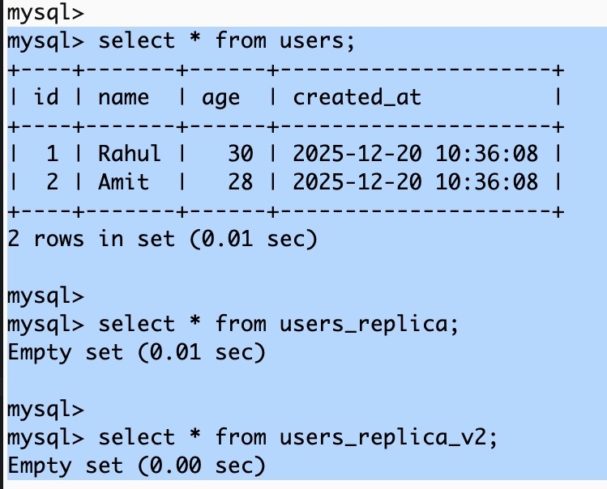

**Step 8: JDBC Sink Connector (CDC → replica_v2) to be in-sync with source table**

<details>
<summary><strong>JDBC Sink Connector Config-v2</strong></summary>

```curl
curl -X POST http://localhost:8083/connectors \
  -H "Content-Type: application/json" \
  -d '{
  "name": "mysql-users-cdc-replica-sink-v2",
  "config": {
    "connector.class": "io.confluent.connect.jdbc.JdbcSinkConnector",
    "tasks.max": "1",

    "topics": "dbserver1.demo.users",

    "connection.url": "jdbc:mysql://mysql:3306/demo",
    "connection.user": "demo",
    "connection.password": "demo",

    "auto.create": "false",
    "auto.evolve": "false",

    "insert.mode": "upsert",
    "delete.enabled": "true",
    "pk.mode": "record_key",
    "pk.fields": "id",

    "table.name.format": "users_replica_v2",

    "key.converter": "io.confluent.connect.avro.AvroConverter",
    "key.converter.schema.registry.url": "http://schema-registry:8081",

    "value.converter": "io.confluent.connect.avro.AvroConverter",
    "value.converter.schema.registry.url": "http://schema-registry:8081",

    "transforms": "unwrap",

    "transforms.unwrap.type": "io.debezium.transforms.ExtractNewRecordState",

    "transforms.unwrap.drop.tombstones": "false",
    "transforms.unwrap.delete.handling.mode": "drop"
  }
}'
```
</details>

**Step 9: Verify Connector Status**
```
curl http://localhost:8083/connectors/mysql-users-cdc-replica-sink-v2/status | jq
```

**Step 10: Create the Debezium MySQL connector**

We have setup `auto.create.topics.enable=false` in kafka broker, so have to create topic pre-hand and then register the connector.

**Create topics**

```
# Create the heartbeat topic for Debezium (topic.prefix)
docker exec -it kafka-broker kafka-topics \
  --bootstrap-server kafka-broker:19092 \
  --create \
  --topic dbserver1 \
  --partitions 1 \
  --replication-factor 1
  
docker exec -it kafka-broker \
  kafka-topics --bootstrap-server kafka-broker:19092 --list
```

Register the connector

<details>
<summary><strong>Source Connector debezium-mysql-users</strong></summary>

```curl
curl -X POST http://localhost:8083/connectors \
  -H "Content-Type: application/json" \
  -d '{
    "name": "debezium-mysql-users",
    "config": {
      "connector.class": "io.debezium.connector.mysql.MySqlConnector",

      "tasks.max": "1",

      "database.hostname": "mysql",
      "database.port": "3306",
      "database.user": "debezium",
      "database.password": "dbz",

      "database.server.id": "184054",
      "topic.prefix": "dbserver1",

      "database.include.list": "demo",
      "table.include.list": "demo.users",

      "snapshot.mode": "initial",

      "schema.history.internal.kafka.bootstrap.servers": "kafka-broker:19092",
      "schema.history.internal.kafka.topic": "schema-history.demo",

      "key.converter": "io.confluent.connect.avro.AvroConverter",
      "key.converter.schema.registry.url": "http://schema-registry:8081",

      "value.converter": "io.confluent.connect.avro.AvroConverter",
      "value.converter.schema.registry.url": "http://schema-registry:8081"
    }
  }'
```
</details>


**Step 11: Verify Connector Status**
```
curl http://localhost:8083/connectors/debezium-mysql-users/status | jq
```

**Step 12: Observe snapshot phase**
```
docker logs kafka-connect | grep -i snapshot
```
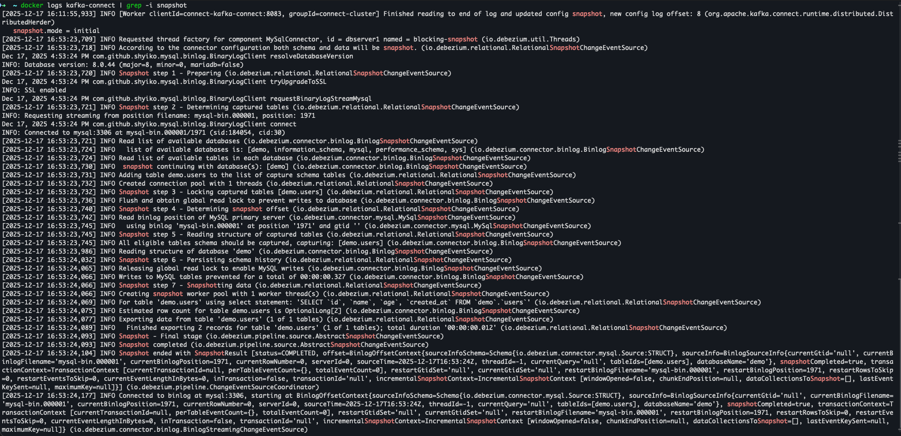

In the attached screenshot, we can see messages indicating:
- Snapshot started
- Snapshot completed

**Step 12: Verify Subject Creation**

```
curl http://localhost:8081/subjects

Expected: ["dbserver1.demo.users-value"]
```
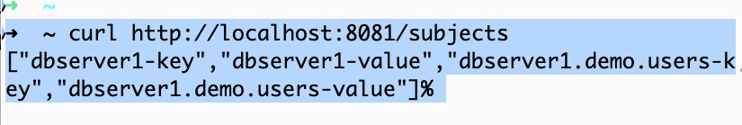

**Step 13: Check Schema in SchemaRegistry**
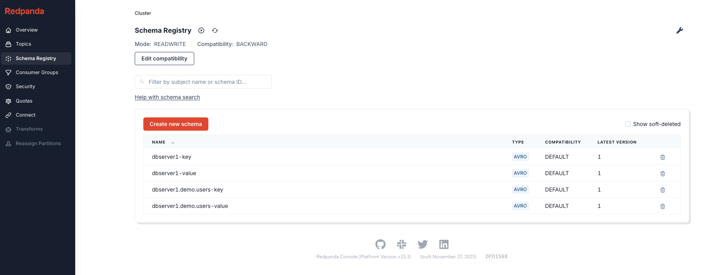


<details>
<summary><strong>Schema for dbserver1-key</strong></summary>

```json
{
    "type": "record",
    "name": "SchemaChangeKey",
    "namespace": "io.debezium.connector.mysql",
    "fields": [
        {
            "name": "databaseName",
            "type": "string"
        }
    ],
    "connect.version": 1,
    "connect.name": "io.debezium.connector.mysql.SchemaChangeKey"
}
```
</details>


<details>
<summary><strong>Schema for dbserver1-value</strong></summary>

```json
{
  "type": "record",
  "name": "SchemaChangeValue",
  "namespace": "io.debezium.connector.mysql",
  "fields": [
    {
      "name": "source",
      "type": {
        "type": "record",
        "name": "Source",
        "fields": [
          {
            "name": "version",
            "type": "string"
          },
          {
            "name": "connector",
            "type": "string"
          },
          {
            "name": "name",
            "type": "string"
          },
          {
            "name": "ts_ms",
            "type": "long"
          },
          {
            "name": "snapshot",
            "type": [
              {
                "type": "string",
                "connect.version": 1,
                "connect.parameters": {
                  "allowed": "true,first,first_in_data_collection,last_in_data_collection,last,false,incremental"
                },
                "connect.default": "false",
                "connect.name": "io.debezium.data.Enum"
              },
              "null"
            ],
            "default": "false"
          },
          {
            "name": "db",
            "type": "string"
          },
          {
            "name": "sequence",
            "type": [
              "null",
              "string"
            ],
            "default": null
          },
          {
            "name": "ts_us",
            "type": [
              "null",
              "long"
            ],
            "default": null
          },
          {
            "name": "ts_ns",
            "type": [
              "null",
              "long"
            ],
            "default": null
          },
          {
            "name": "table",
            "type": [
              "null",
              "string"
            ],
            "default": null
          },
          {
            "name": "server_id",
            "type": "long"
          },
          {
            "name": "gtid",
            "type": [
              "null",
              "string"
            ],
            "default": null
          },
          {
            "name": "file",
            "type": "string"
          },
          {
            "name": "pos",
            "type": "long"
          },
          {
            "name": "row",
            "type": "int"
          },
          {
            "name": "thread",
            "type": [
              "null",
              "long"
            ],
            "default": null
          },
          {
            "name": "query",
            "type": [
              "null",
              "string"
            ],
            "default": null
          }
        ],
        "connect.version": 1,
        "connect.name": "io.debezium.connector.mysql.Source"
      }
    },
    {
      "name": "ts_ms",
      "type": "long"
    },
    {
      "name": "databaseName",
      "type": [
        "null",
        "string"
      ],
      "default": null
    },
    {
      "name": "schemaName",
      "type": [
        "null",
        "string"
      ],
      "default": null
    },
    {
      "name": "ddl",
      "type": [
        "null",
        "string"
      ],
      "default": null
    },
    {
      "name": "tableChanges",
      "type": {
        "type": "array",
        "items": {
          "type": "record",
          "name": "Change",
          "namespace": "io.debezium.connector.schema",
          "fields": [
            {
              "name": "type",
              "type": "string"
            },
            {
              "name": "id",
              "type": "string"
            },
            {
              "name": "table",
              "type": [
                "null",
                {
                  "type": "record",
                  "name": "Table",
                  "fields": [
                    {
                      "name": "defaultCharsetName",
                      "type": [
                        "null",
                        "string"
                      ],
                      "default": null
                    },
                    {
                      "name": "primaryKeyColumnNames",
                      "type": [
                        "null",
                        {
                          "type": "array",
                          "items": "string"
                        }
                      ],
                      "default": null
                    },
                    {
                      "name": "columns",
                      "type": {
                        "type": "array",
                        "items": {
                          "type": "record",
                          "name": "Column",
                          "fields": [
                            {
                              "name": "name",
                              "type": "string"
                            },
                            {
                              "name": "jdbcType",
                              "type": "int"
                            },
                            {
                              "name": "nativeType",
                              "type": [
                                "null",
                                "int"
                              ],
                              "default": null
                            },
                            {
                              "name": "typeName",
                              "type": "string"
                            },
                            {
                              "name": "typeExpression",
                              "type": [
                                "null",
                                "string"
                              ],
                              "default": null
                            },
                            {
                              "name": "charsetName",
                              "type": [
                                "null",
                                "string"
                              ],
                              "default": null
                            },
                            {
                              "name": "length",
                              "type": [
                                "null",
                                "int"
                              ],
                              "default": null
                            },
                            {
                              "name": "scale",
                              "type": [
                                "null",
                                "int"
                              ],
                              "default": null
                            },
                            {
                              "name": "position",
                              "type": "int"
                            },
                            {
                              "name": "optional",
                              "type": [
                                "null",
                                "boolean"
                              ],
                              "default": null
                            },
                            {
                              "name": "autoIncremented",
                              "type": [
                                "null",
                                "boolean"
                              ],
                              "default": null
                            },
                            {
                              "name": "generated",
                              "type": [
                                "null",
                                "boolean"
                              ],
                              "default": null
                            },
                            {
                              "name": "comment",
                              "type": [
                                "null",
                                "string"
                              ],
                              "default": null
                            },
                            {
                              "name": "defaultValueExpression",
                              "type": [
                                "null",
                                "string"
                              ],
                              "default": null
                            },
                            {
                              "name": "enumValues",
                              "type": [
                                "null",
                                {
                                  "type": "array",
                                  "items": "string"
                                }
                              ],
                              "default": null
                            }
                          ],
                          "connect.version": 1,
                          "connect.name": "io.debezium.connector.schema.Column"
                        }
                      }
                    },
                    {
                      "name": "comment",
                      "type": [
                        "null",
                        "string"
                      ],
                      "default": null
                    }
                  ],
                  "connect.version": 1,
                  "connect.name": "io.debezium.connector.schema.Table"
                }
              ],
              "default": null
            }
          ],
          "connect.version": 1,
          "connect.name": "io.debezium.connector.schema.Change"
        }
      }
    }
  ],
  "connect.version": 1,
  "connect.name": "io.debezium.connector.mysql.SchemaChangeValue"
}
```
</details>


<details>
<summary><strong>Schema for dbserver1.demo.users-key</strong></summary>

```json
{
  "type": "record",
  "name": "Key",
  "namespace": "dbserver1.demo.users",
  "fields": [
    {
      "name": "id",
      "type": "int"
    }
  ],
  "connect.name": "dbserver1.demo.users.Key"
}
```
</details>


<details>
<summary><strong>Schema for dbserver1.demo.users-value</strong></summary>

```json
{
  "type": "record",
  "name": "Envelope",
  "namespace": "dbserver1.demo.users",
  "fields": [
    {
      "name": "before",
      "type": [
        "null",
        {
          "type": "record",
          "name": "Value",
          "fields": [
            {
              "name": "id",
              "type": "int"
            },
            {
              "name": "name",
              "type": [
                "null",
                "string"
              ],
              "default": null
            },
            {
              "name": "age",
              "type": [
                "null",
                "int"
              ],
              "default": null
            },
            {
              "name": "created_at",
              "type": [
                "null",
                {
                  "type": "string",
                  "connect.version": 1,
                  "connect.name": "io.debezium.time.ZonedTimestamp"
                }
              ],
              "default": null
            }
          ],
          "connect.name": "dbserver1.demo.users.Value"
        }
      ],
      "default": null
    },
    {
      "name": "after",
      "type": [
        "null",
        "Value"
      ],
      "default": null
    },
    {
      "name": "source",
      "type": {
        "type": "record",
        "name": "Source",
        "namespace": "io.debezium.connector.mysql",
        "fields": [
          {
            "name": "version",
            "type": "string"
          },
          {
            "name": "connector",
            "type": "string"
          },
          {
            "name": "name",
            "type": "string"
          },
          {
            "name": "ts_ms",
            "type": "long"
          },
          {
            "name": "snapshot",
            "type": [
              {
                "type": "string",
                "connect.version": 1,
                "connect.parameters": {
                  "allowed": "true,first,first_in_data_collection,last_in_data_collection,last,false,incremental"
                },
                "connect.default": "false",
                "connect.name": "io.debezium.data.Enum"
              },
              "null"
            ],
            "default": "false"
          },
          {
            "name": "db",
            "type": "string"
          },
          {
            "name": "sequence",
            "type": [
              "null",
              "string"
            ],
            "default": null
          },
          {
            "name": "ts_us",
            "type": [
              "null",
              "long"
            ],
            "default": null
          },
          {
            "name": "ts_ns",
            "type": [
              "null",
              "long"
            ],
            "default": null
          },
          {
            "name": "table",
            "type": [
              "null",
              "string"
            ],
            "default": null
          },
          {
            "name": "server_id",
            "type": "long"
          },
          {
            "name": "gtid",
            "type": [
              "null",
              "string"
            ],
            "default": null
          },
          {
            "name": "file",
            "type": "string"
          },
          {
            "name": "pos",
            "type": "long"
          },
          {
            "name": "row",
            "type": "int"
          },
          {
            "name": "thread",
            "type": [
              "null",
              "long"
            ],
            "default": null
          },
          {
            "name": "query",
            "type": [
              "null",
              "string"
            ],
            "default": null
          }
        ],
        "connect.version": 1,
        "connect.name": "io.debezium.connector.mysql.Source"
      }
    },
    {
      "name": "transaction",
      "type": [
        "null",
        {
          "type": "record",
          "name": "block",
          "namespace": "event",
          "fields": [
            {
              "name": "id",
              "type": "string"
            },
            {
              "name": "total_order",
              "type": "long"
            },
            {
              "name": "data_collection_order",
              "type": "long"
            }
          ],
          "connect.version": 1,
          "connect.name": "event.block"
        }
      ],
      "default": null
    },
    {
      "name": "op",
      "type": "string"
    },
    {
      "name": "ts_ms",
      "type": [
        "null",
        "long"
      ],
      "default": null
    },
    {
      "name": "ts_us",
      "type": [
        "null",
        "long"
      ],
      "default": null
    },
    {
      "name": "ts_ns",
      "type": [
        "null",
        "long"
      ],
      "default": null
    }
  ],
  "connect.version": 2,
  "connect.name": "dbserver1.demo.users.Envelope"
}
```
</details>


**Step 14: Consume from topic**
```
docker exec -it kafka-broker kafka-console-consumer \
  --bootstrap-server kafka-broker:19092 \
  --topic dbserver1.demo.users \
  --from-beginning
```
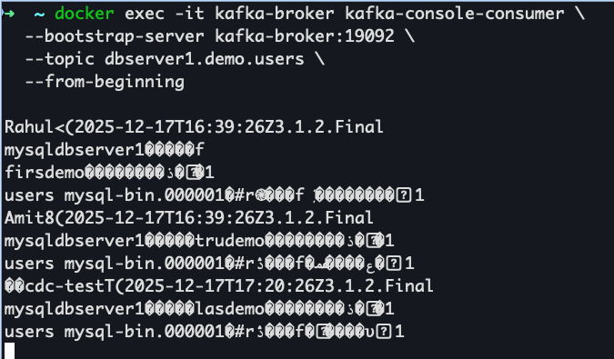

**Step 15: Query Sink Tables**


**Step 16: Tests**
```
docker exec -it mysql mysql -u demo -pdemo demo

INSERT INTO users (id, name, age) VALUES (10, 'A', 30);

SELECT * FROM users;

SELECT * FROM users_replica;

SELECT * FROM users_replica_v2;
```
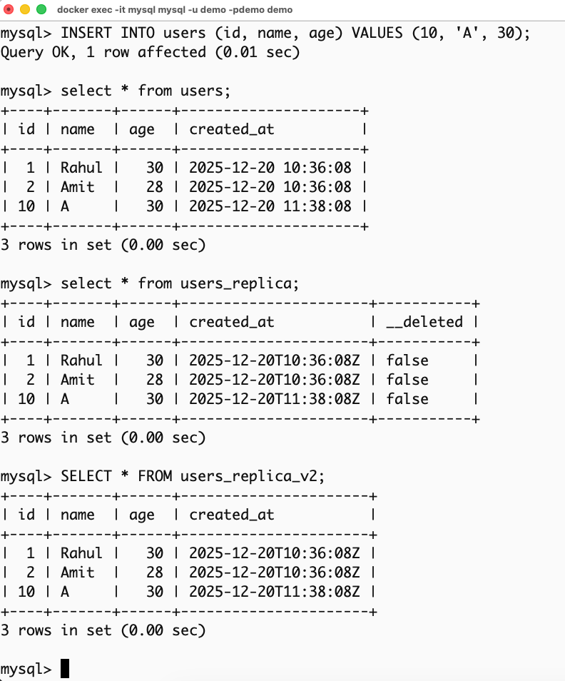


```
UPDATE users SET age=31 WHERE id=10;

SELECT * FROM users;

SELECT * FROM users_replica;

SELECT * FROM users_replica_v2;
```
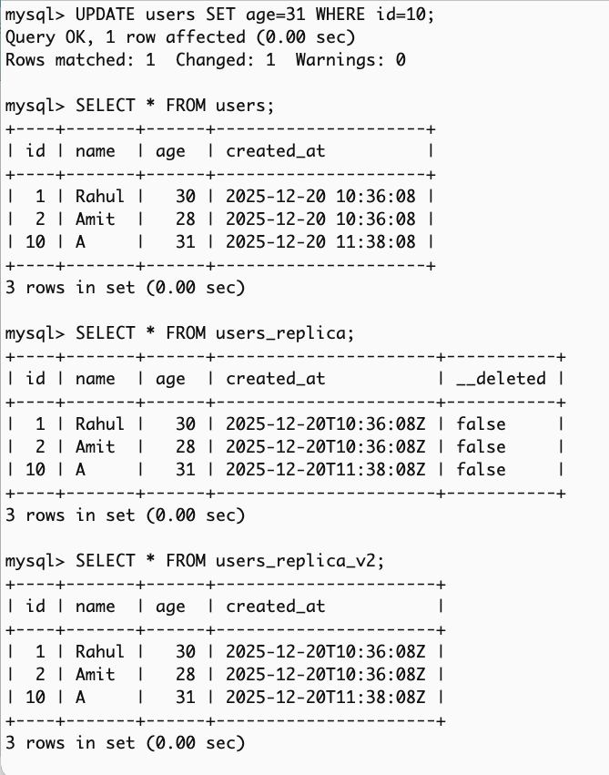

```
INSERT INTO users (id, name, age) VALUES (20, 'CDC-Test', 40);

SELECT * FROM users;

SELECT * FROM users_replica;

SELECT * FROM users_replica_v2;
```
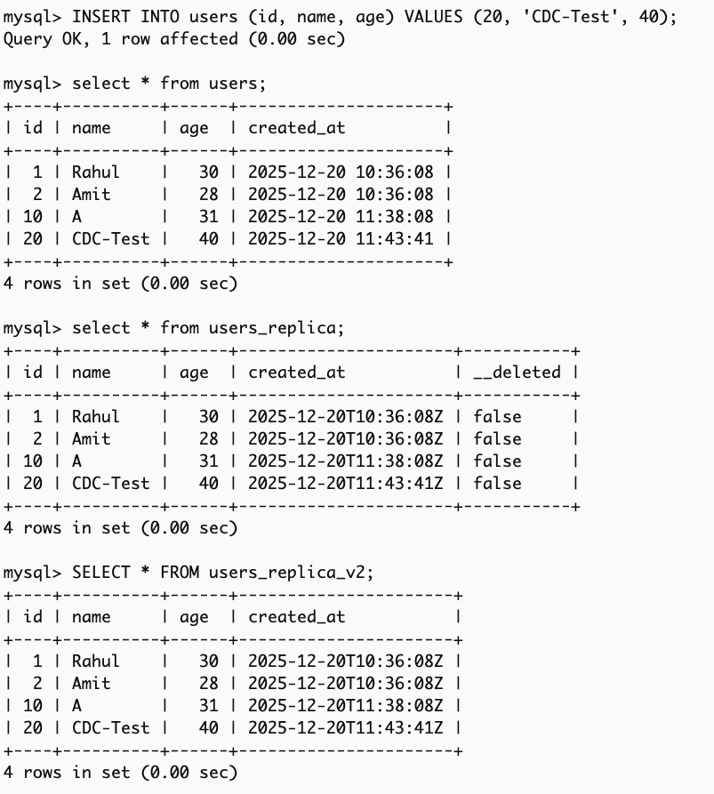


```
UPDATE users SET age=41 WHERE id=20;

SELECT * FROM users;

SELECT * FROM users_replica;

SELECT * FROM users_replica_v2;
```
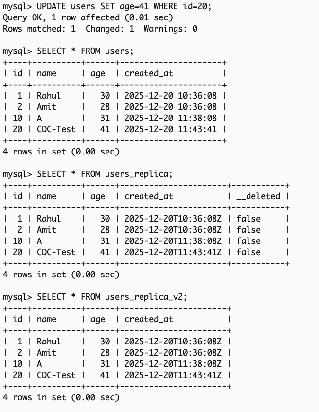

In the following Delete-Test case, we can see that the row for id=20 is deleted from users table where we deleted
and also got deleted from `users_replica_v2` table because the sink for this is working exactly as replica for the source whereas the entry in
`users_replica` is marked `true` in `__deleted` column but not actually deleted which helps in use-cases where we might need
to audit or replay the exact events.
```
DELETE FROM users WHERE id=20;

SELECT * FROM users;

SELECT * FROM users_replica;

SELECT * FROM users_replica_v2;
```
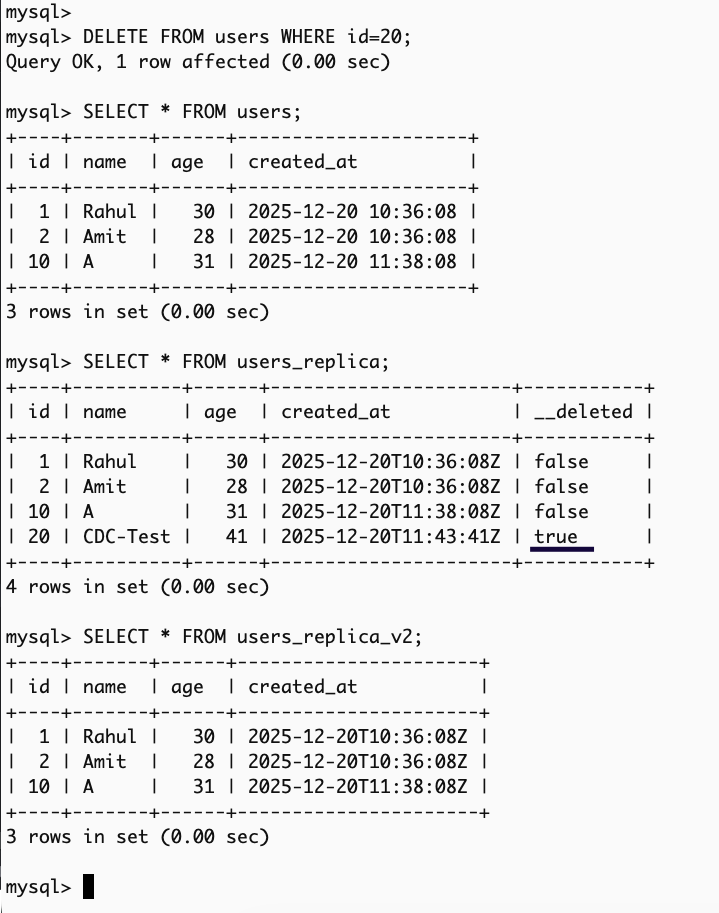


**Step 17: Check decoded messages from topic on Redpanda-Console Web UI**
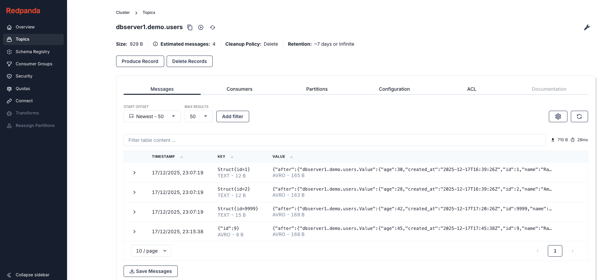
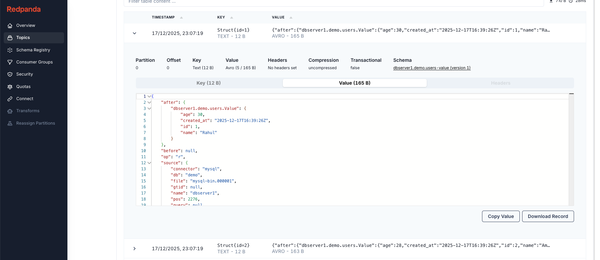

**Decoded value, this is a Debezium Change Event Envelope, not a row.**

This envelope is for CDC pipelines, not business APIs.
```
{
    "after": {
        "dbserver1.demo.users.Value": {
            "age": 30,
            "created_at": "2025-12-17T16:39:26Z",
            "id": 1,
            "name": "Rahul"
        }
    },
    "before": null,
    "op": "r",
    "source": {
        "connector": "mysql",
        "db": "demo",
        "file": "mysql-bin.000001",
        "gtid": null,
        "name": "dbserver1",
        "pos": 2276,
        "query": null,
        "row": 0,
        "sequence": null,
        "server_id": 0,
        "snapshot": "first",
        "table": "users",
        "thread": null,
        "ts_ms": 1765992367000,
        "ts_ns": "1765992367000000000",
        "ts_us": "1765992367000000",
        "version": "3.1.2.Final"
    },
    "transaction": null,
    "ts_ms": 1765992367019,
    "ts_ns": "1765992367019835467",
    "ts_us": "1765992367019835"
}
```

**Understanding Debezium envelope**
The event has these major sections:
```
{
  "before": null,
  "after": {...},
  "op": "r",
  "source": {...},
  "transaction": null,
  "ts_ms": ...
}
```
i) op — the most important field

| op | Meaning | When it appers          | 
|----|---------|-------------------------|
| r  | Read    | Snapshot (initial load) |
| c  | Create  | INSERT                  |
| u  | Update  | UPDATE                  |
| d  | Delete  | DELETE                  |

ii) before and after

- before → row state before the change
- after → row state after the change

For snapshots and inserts:
- before = null
- after = full row

For updates:
- before = old row
- after = new row

For deletes:
- before = last row
- after = null

iii) source — metadata
```
"source": {
  "connector": "mysql",
  "db": "demo",
  "table": "users",
  "name": "dbserver1",
  "file": "mysql-bin.000001",
  "pos": 2276,
  "snapshot": "first",
  "version": "3.1.2.Final"
}
```
This allows:
- Auditing
- Replay
- Debugging corruption
- Multi-table routing
- Multi-DB pipelines

`"snapshot": "first"` - This row came from the initial snapshot, not from live binlog changes, for last event from binlog for snapshot will have this field as `"snapshot": "last"` and anything in-between this will have `"snapshot": "true"`. 
Later, for new inserts/updates, this field will be false.


**Tombstones**
When you run a DELETE on the source table, Debezium does not emit just one event. It emits two Kafka records, back-to-back, with the same key.

Event 1: Delete Change Event (the "business delete")
```
Key: {"id":20}


value: 
{
    "after": null,
    "before": {
        "dbserver1.demo.users.Value": {
            "age": 41,
            "created_at": "2025-12-20T11:43:41Z",
            "id": 20,
            "name": "CDC-Test"
        }
    },
    "op": "d",
    "source": {
        "connector": "mysql",
        "db": "demo",
        "file": "mysql-bin.000003",
        "gtid": null,
        "name": "dbserver1",
        "pos": 7758,
        "query": null,
        "row": 0,
        "sequence": null,
        "server_id": 1,
        "snapshot": "false",
        "table": "users",
        "thread": 10,
        "ts_ms": 1766231231000,
        "ts_ns": "1766231231000000000",
        "ts_us": "1766231231000000",
        "version": "3.1.2.Final"
    },
    "transaction": null,
    "ts_ms": 1766231231095,
    "ts_ns": "1766231231095046634",
    "ts_us": "1766231231095046"
}
```

Event 2: Tombstone Event (the "Kafka cleanup signal")
```
key: {"id":20}


value: null
```
This record is called a tombstone. It does not represent a database operation. It exists purely for Kafka’s internal semantics. 
**Why does Debezium emit a tombstone?**

Kafka topics are append-only logs, not databases. In log-compacted topics, Kafka keeps only the latest value per key.

If Kafka never receives a key → null record:
- The last value for that key may live forever
- Consumers joining later may still see stale data

The tombstone tells Kafka: _This key should be considered deleted. Please remove it during log compaction._


Cleanup: 
```
curl -X DELETE http://localhost:8083/connectors/debezium-mysql-users
curl -X DELETE http://localhost:8083/connectors/mysql-users-cdc-replica-sink
curl -X DELETE http://localhost:8083/connectors/mysql-users-cdc-replica-sink-v2

curl -X DELETE http://localhost:8081/subjects/dbserver1.demo.users-value

curl -X DELETE http://localhost:8081/subjects/dbserver1.demo.users-key

curl -X DELETE \
  "http://localhost:8081/subjects/dbserver1.demo.users-value?permanent=true"

curl -X DELETE \
  "http://localhost:8081/subjects/dbserver1.demo.users-key?permanent=true"

```

---
Useful Command:
1. Reset Consumer Group Offset (Make sure no active consumer group exists for that group)
```
docker exec -it kafka-broker kafka-consumer-groups \
  --bootstrap-server kafka-broker:19092 \
  --group <CG-Group-Name> \
  --reset-offsets \
  --to-earliest \
  --execute \
  --topic dbserver1.demo.users
```
