# Debezium CDC → ElasticSearch Sink 

Plan for this exercise
```
MySQL
  |
  |  (binlog)
  v
Debezium MySQL Source (Kafka Connect)
  |
  v
Kafka Topic (CDC events)
  |
  v
ElasticSearch Sink Connector
  |
  v
ElasticSearch Index (searchable CDC stream)
```

ElasticSearch is NOT a replica database. It is a searchable, queryable event projection.

What this example will demonstrate
 - Log-based CDC into ElasticSearch
 - Schema Registry + Avro 
 - Delete handling in search systems
 - Index-per-table strategy
 - How CDC maps naturally to document stores


## Setup
**Step 1: Add ElasticSearch to docker-compose**

<details><summary><strong>Add ElasticSearch and Kibana services to docker-compose.yml</strong></summary>

```yaml
  elasticsearch:
    image: docker.elastic.co/elasticsearch/elasticsearch:8.12.0
    container_name: elasticsearch
    environment:
      - discovery.type=single-node
      - xpack.security.enabled=false
      - ES_JAVA_OPTS=-Xms512m -Xmx512m
    ports:
      - "9200:9200"
    volumes:
      - es-data:/usr/share/elasticsearch/data
    networks:
      - kafka-network
    healthcheck:
      test: [ "CMD-SHELL", "curl -s http://localhost:9200 >/dev/null || exit 1" ]
      interval: 10s
      timeout: 10s
      retries: 10

  kibana:
    image: docker.elastic.co/kibana/kibana:8.12.0
    environment:
      - ELASTICSEARCH_HOSTS=http://elasticsearch:9200
    ports:
      - "5601:5601"
    depends_on:
      - elasticsearch
    networks:
      - kafka-network
```
</details>

**Validations**
1. Start Services
```
docker-compose up -d ElasticSearch ElasticSearch-dashboards
```

2. Validate ElasticSearch is running
```
curl http://localhost:9200

curl http://localhost:9200/_cluster/health?pretty
```

Expected: 
```
{
  "cluster_name" : "docker-cluster",
  "version" : {
    "number" : "8.12.0",
    "build_type" : "docker",
    "build_snapshot" : false,
    "lucene_version" : "9.9.1"
  },
  "tagline" : "You Know, for Search"
}
```

3. Validate ElasticSearch index create, get and delete
```
curl -X PUT http://localhost:9200/test-index \
  -H "Content-Type: application/json" \
  -d '{
    "mappings": {
      "properties": {
        "id":   { "type": "integer" },
        "name": { "type": "keyword" }
      }
    }
  }'


curl http://localhost:9200/test-index/_search?pretty

curl -X DELETE http://localhost:9200/test-index
```


4. Validate Dashboard UI, open in browser:
```
http://localhost:5601
```

**Step 2: Install ElasticSearch Sink Connector**

Update Kafka Connect Dockerfile
```
# ------------------------------------------------------------
# Install ElasticSearch Sink Connector
# ------------------------------------------------------------
RUN confluent-hub install --no-prompt confluentinc/kafka-connect-elasticsearch:15.1.0
```

Rebuild Kafka Connect
```
docker-compose stop kafka-connect
docker-compose build --no-cache kafka-connect
docker-compose up -d kafka-connect
```

**Validations**
1. Verify plugin availability
```
curl http://localhost:8083/connector-plugins | jq '.[] | select(.class | contains("elasticsearch"))'
```

Expected:
```
{
  "class": "org.ElasticSearch.kafka.connect.ElasticSearchSinkConnector",
  "type": "sink",
  "version": "2.12.0"
}
```
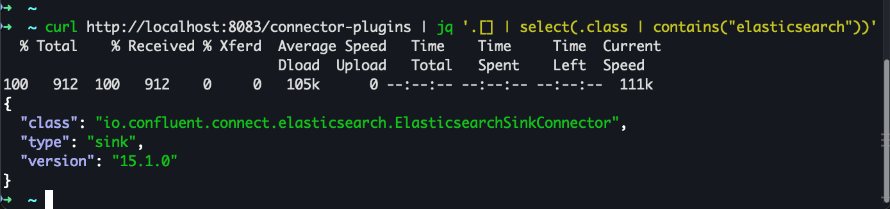

**Step 3: Permit Debezium Users Replication level privileges**
```
# for administrative setup, login using root user
docker exec -it mysql mysql -uroot -proot

CREATE USER 'debezium'@'%' IDENTIFIED BY 'dbz';

GRANT SELECT, RELOAD, SHOW DATABASES, REPLICATION SLAVE, REPLICATION CLIENT ON *.* TO 'debezium'@'%';

FLUSH PRIVILEGES;
```

**Step 4: Create MySQL Source Table**
```
docker exec -it mysql mysql -u demo -pdemo demo

DROP TABLE IF EXISTS users_os;

CREATE TABLE users_os (
  id INT PRIMARY KEY,
  name VARCHAR(255),
  age INT,
  created_at TIMESTAMP DEFAULT CURRENT_TIMESTAMP
);

# these rows will be picked up during snapshot
INSERT INTO users_os (id, name, age) VALUES
(1, 'Rahul', 30),
(2, 'Amit', 28);
```

**Step 5: Create heartbeat and Source Topics**
```
docker exec -it kafka-broker kafka-topics \
  --bootstrap-server kafka-broker:19092 \
  --create \
  --topic dbserver1 \
  --partitions 1 \
  --replication-factor 1

docker exec -it kafka-broker kafka-topics \
  --bootstrap-server kafka-broker:19092 \
  --create \
  --topic dbserver1.demo.users_os \
  --partitions 1 \
  --replication-factor 1
```

---

## Examples
### Ex 1: CDC Event Streaming

**STEP 1: Create ElasticSearch Sink Connector**

<details><summary><strong>Sink Connector Config</strong></summary>

```curl
curl -X POST http://localhost:8083/connectors \
  -H "Content-Type: application/json" \
  -d '{
  "name": "elasticsearch-users-cdc-sink",
  "config": {
    "connector.class": "io.confluent.connect.elasticsearch.ElasticsearchSinkConnector",
    "tasks.max": "1",

    "topics": "dbserver1.demo.users_os",

    "connection.url": "http://elasticsearch:9200",

    "type.name": "_doc",

    "schema.ignore": "false",
    "key.ignore": "true",

    "behavior.on.null.values": "ignore",

    "write.method": "insert",

    "max.in.flight.requests": "1",

    "key.converter": "io.confluent.connect.avro.AvroConverter",
    "key.converter.schema.registry.url": "http://schema-registry:8081",

    "value.converter": "io.confluent.connect.avro.AvroConverter",
    "value.converter.schema.registry.url": "http://schema-registry:8081",

    "transforms": "unwrap",

    "transforms.unwrap.type": "io.debezium.transforms.ExtractNewRecordState",
    "transforms.unwrap.drop.tombstones": "true",
    "transforms.unwrap.delete.handling.mode": "rewrite"
  }
}'
```
</details>

**Response**
```json
{"name":"elasticsearch-users-cdc-sink","config":{"connector.class":"io.confluent.connect.elasticsearch.ElasticsearchSinkConnector","tasks.max":"1","topics":"dbserver1.demo.users_os","connection.url":"http://elasticsearch:9200","type.name":"_doc","schema.ignore":"false","key.ignore":"true","behavior.on.null.values":"ignore","write.method":"insert","max.in.flight.requests":"1","key.converter":"io.confluent.connect.avro.AvroConverter","key.converter.schema.registry.url":"http://schema-registry:8081","value.converter":"io.confluent.connect.avro.AvroConverter","value.converter.schema.registry.url":"http://schema-registry:8081","transforms":"unwrap","transforms.unwrap.type":"io.debezium.transforms.ExtractNewRecordState","transforms.unwrap.drop.tombstones":"true","transforms.unwrap.delete.handling.mode":"rewrite","name":"elasticsearch-users-cdc-sink"},"tasks":[],"type":"sink"}
```

**Verify Sink Connector is running**
```
curl http://localhost:8083/connectors/elasticsearch-users-cdc-sink/status | jq
```

**STEP 2: Create Debezium MySQL Source Connector**
<details><summary><strong>Source Connector</strong></summary>

```curl
curl -X POST http://localhost:8083/connectors \
  -H "Content-Type: application/json" \
  -d '{
    "name": "debezium-mysql-users_os",
    "config": {
      "connector.class": "io.debezium.connector.mysql.MySqlConnector",

      "tasks.max": "1",

      "database.hostname": "mysql",
      "database.port": "3306",
      "database.user": "debezium",
      "database.password": "dbz",

      "database.server.id": "184054",
      "topic.prefix": "dbserver1",

      "database.include.list": "demo",
      "table.include.list": "demo.users_os",

      "snapshot.mode": "initial",

      "schema.history.internal.kafka.bootstrap.servers": "kafka-broker:19092",
      "schema.history.internal.kafka.topic": "schema-history.demo",

      "key.converter": "io.confluent.connect.avro.AvroConverter",
      "key.converter.schema.registry.url": "http://schema-registry:8081",

      "value.converter": "io.confluent.connect.avro.AvroConverter",
      "value.converter.schema.registry.url": "http://schema-registry:8081"
    }
  }'
```
</details>

OUTPUT:
```json
{"name":"debezium-mysql-users_os","config":{"connector.class":"io.debezium.connector.mysql.MySqlConnector","tasks.max":"1","database.hostname":"mysql","database.port":"3306","database.user":"debezium","database.password":"dbz","database.server.id":"184054","topic.prefix":"dbserver1","database.include.list":"demo","table.include.list":"demo.users_os","snapshot.mode":"initial","schema.history.internal.kafka.bootstrap.servers":"kafka-broker:19092","schema.history.internal.kafka.topic":"schema-history.demo","key.converter":"io.confluent.connect.avro.AvroConverter","key.converter.schema.registry.url":"http://schema-registry:8081","value.converter":"io.confluent.connect.avro.AvroConverter","value.converter.schema.registry.url":"http://schema-registry:8081","name":"debezium-mysql-users_os"},"tasks":[],"type":"source"}
```


**Verify Source Connector is running**
```
curl http://localhost:8083/connectors/debezium-mysql-users_os/status | jq
```

**Step 3: Validations**

**Verify snapshot execution**
```
docker logs kafka-connect | grep -i snapshot
```

Verify Subject Registration
```
curl http://localhost:8081/subjects
```
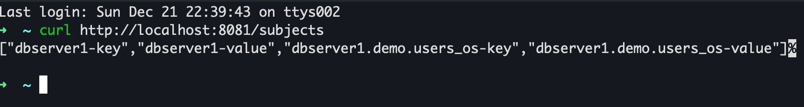

**Verify ElasticSearch Index Creation**
```
curl http://localhost:9200/_cat/indices?v
```
Expected: `dbserver1.demo.users_os`


Query Data in ElasticSearch
```
curl http://localhost:9200/dbserver1.demo.users_os/_search?pretty
```
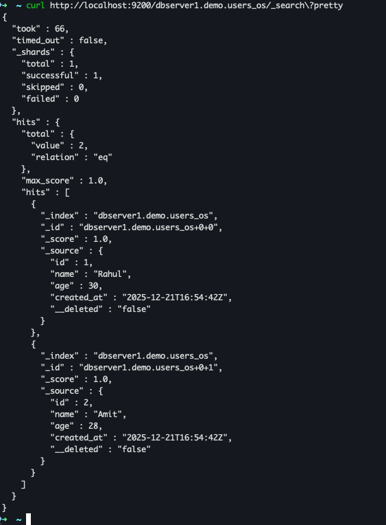


View Snapshot Data in Kibana UI
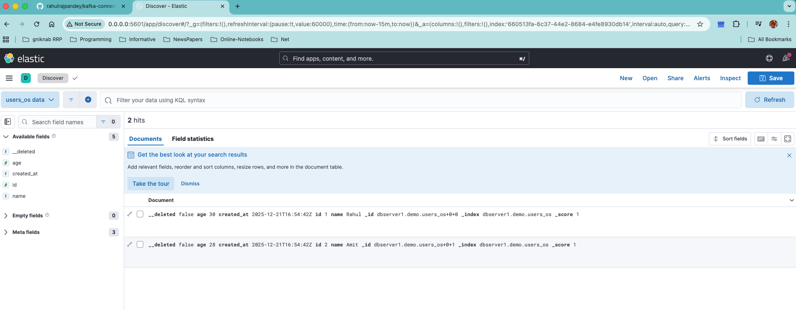

**STEP 4: Test Live CDC Flow**

```
docker exec -it mysql mysql -u demo -pdemo demo

INSERT INTO users_os (id, name, age) VALUES (99, 'OS-Test', 40);
UPDATE users_os SET age=41 WHERE id=99;

```
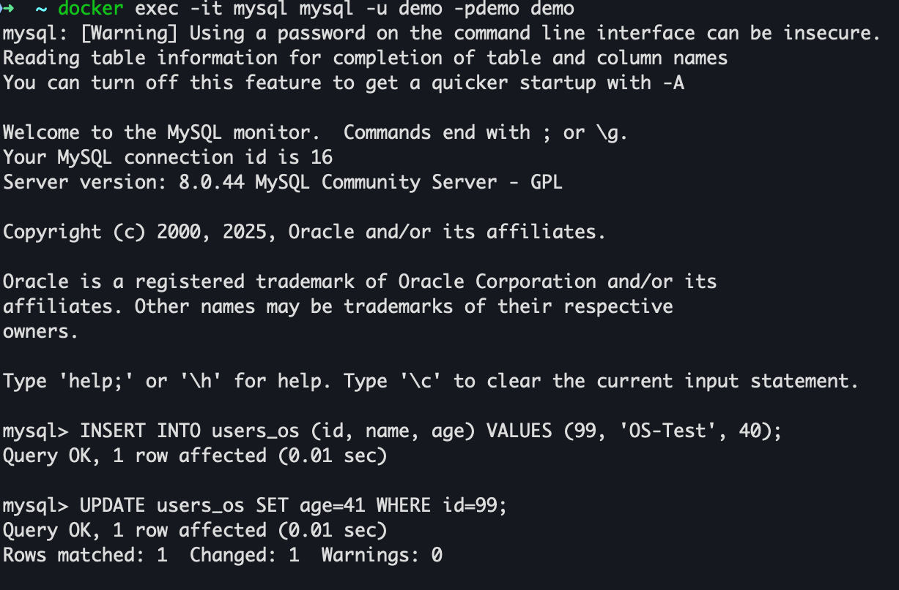
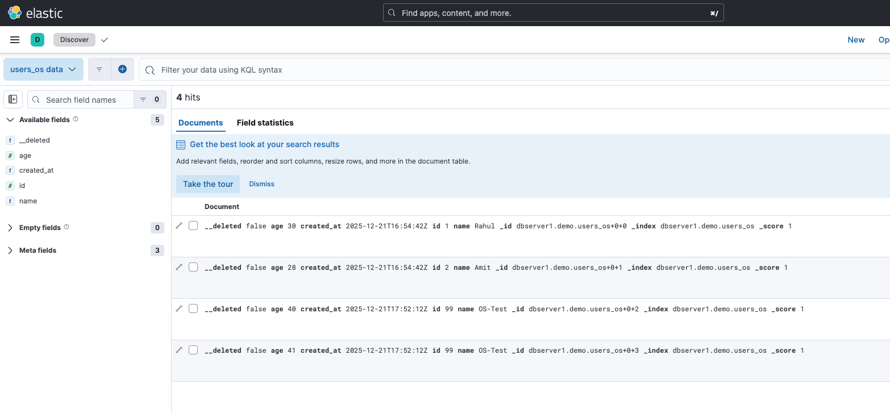


```
DELETE FROM users_os WHERE id=99;
```
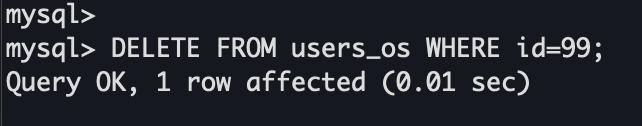
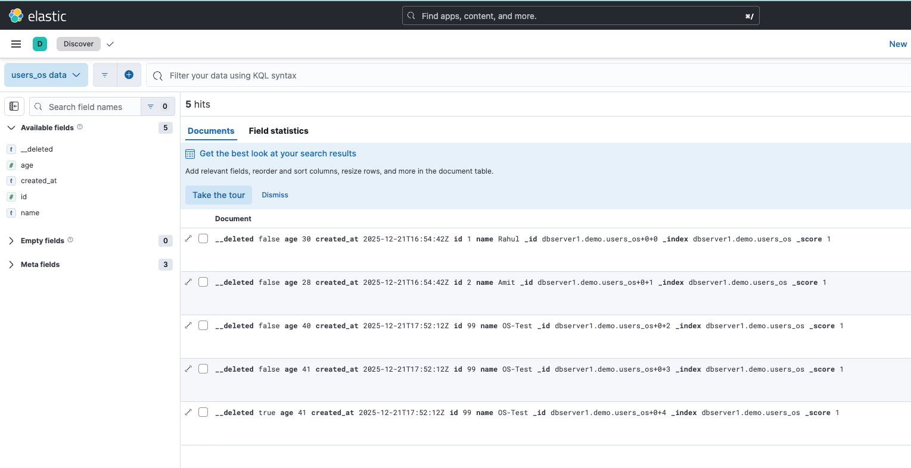


---

### Ex 2: Schema Evolution (Add Column)

Db Change:
```
ALTER TABLE users_os ADD COLUMN email VARCHAR(255);

INSERT INTO users_os (id, name, age, email) VALUES (100, 'Schema-Test', 35, 'schema@test.com');
```

The change in Schema is not being picked by the ElasticSearch Sink Connector as we have used `"schema.ignore": "false" `
which essentially ignores any new update to the schema after this connector has been registered.
So let's delete the sink connector and re-register with schema.ignore to true.
Then connector:
 - Stops enforcing Kafka Connect schemas
 - Sends plain JSON documents to Elasticsearch
 - Lets Elasticsearch dynamically infer fields
 - Allows schema evolution to appear automatically

```
curl -X DELETE http://localhost:8083/connectors/elasticsearch-users-cdc-sink
```

>**Imp Note**

> With schema.ignore=true, the Elasticsearch Sink Connector treats CDC events as schemaless JSON.
> This allows flexible ingestion and automatic field discovery, but Elasticsearch mappings remain immutable once created.
> As a result, column type changes in the source database do not update existing field mappings in Elasticsearch,
> which can lead to silent data loss or indexing failures when incompatible values are encountered.

> For production systems, schema-breaking changes (such as column type modifications) should be handled by creating a new index with the updated mappings,
> while keeping the previous index intact for historical queries, audits, or replay.
> Index versioning and controlled reindexing should be used instead of relying on dynamic mapping evolution.

> We are enabling this only for learning and testing purpose.

**Create ElasticSearch Sink Connector**

<details><summary><strong>Sink Connector Config</strong></summary>

```curl
curl -X POST http://localhost:8083/connectors \
  -H "Content-Type: application/json" \
  -d '{
  "name": "elasticsearch-users-cdc-sink",
  "config": {
    "connector.class": "io.confluent.connect.elasticsearch.ElasticsearchSinkConnector",
    "tasks.max": "1",

    "topics": "dbserver1.demo.users_os",

    "connection.url": "http://elasticsearch:9200",

    "type.name": "_doc",

    "schema.ignore": "true",
    "key.ignore": "true",

    "behavior.on.null.values": "ignore",

    "write.method": "insert",

    "max.in.flight.requests": "1",

    "key.converter": "io.confluent.connect.avro.AvroConverter",
    "key.converter.schema.registry.url": "http://schema-registry:8081",

    "value.converter": "io.confluent.connect.avro.AvroConverter",
    "value.converter.schema.registry.url": "http://schema-registry:8081",

    "transforms": "unwrap",

    "transforms.unwrap.type": "io.debezium.transforms.ExtractNewRecordState",
    "transforms.unwrap.drop.tombstones": "true",
    "transforms.unwrap.delete.handling.mode": "rewrite"
  }
}'
```
</details>

**Validations**

i) As we added new field `email` in the table, there should be a new schema registered for this subject.
```
curl http://localhost:8081/subjects | jq

curl http://localhost:8081/subjects/dbserver1.demo.users_os-value/versions | jq

curl http://localhost:8081/subjects/dbserver1.demo.users_os-value/versions/latest | jq
```
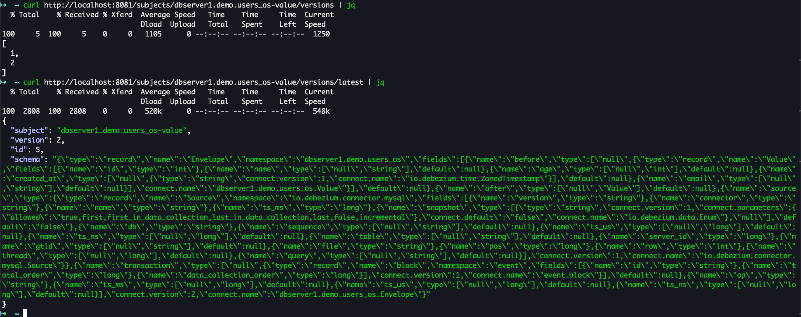

ii) Verify key schema stability
```
curl http://localhost:8081/subjects/dbserver1.demo.users_os-key/versions | jq
```
- Primary key (id) did not change
- Keys should be stable
- This ensures partitioning and compaction correctness

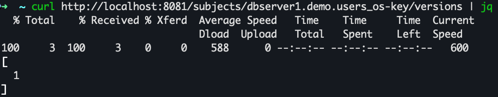

iii) Kafka Topic Data

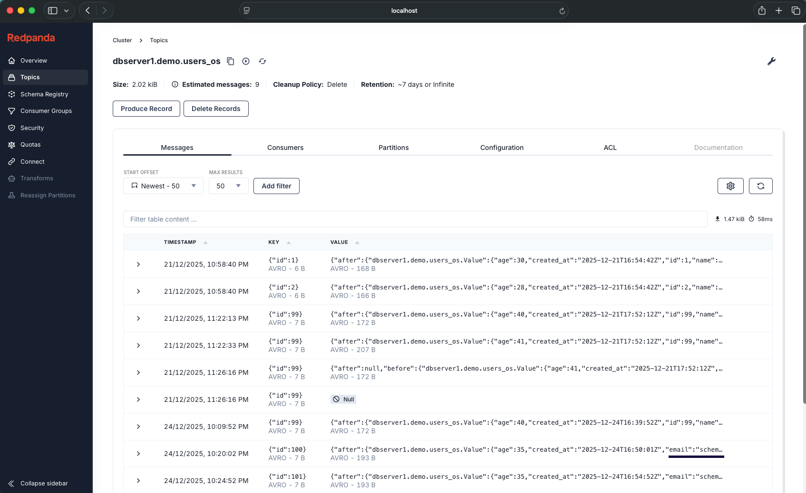

iv) Index in ElasticSearch must update
```
curl http://localhost:9200/dbserver1.demo.users_os/_search\?pretty

curl http://localhost:9200/dbserver1.demo.users_os/_mapping | jq
```
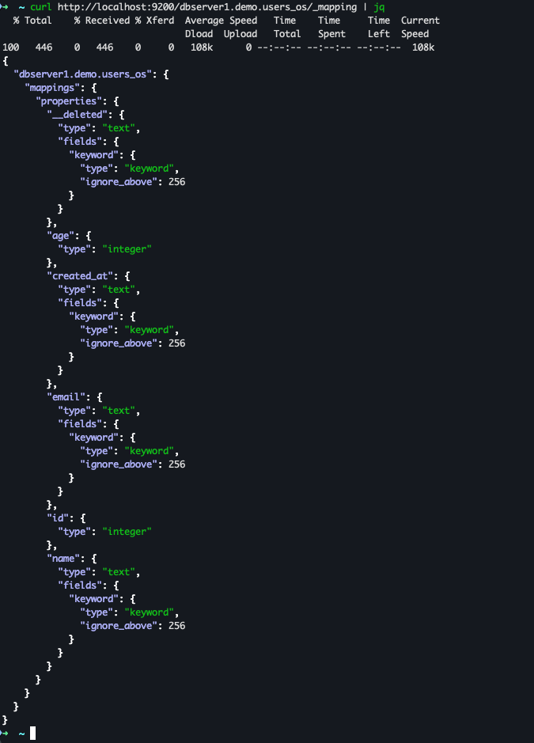

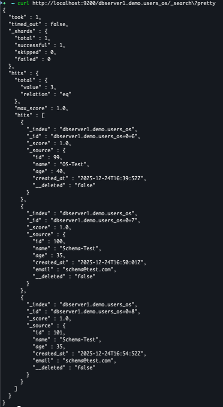

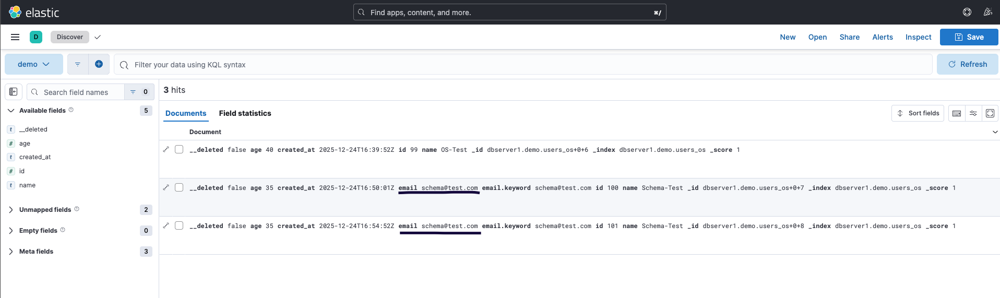

### Ex 2: Schema Evolution (Drop Column)

Db Change: 
```
ALTER TABLE users_os DROP COLUMN email;

INSERT INTO users_os (id, name, age) VALUES (102, 'Schema-Test-3', 39);
```

**Validations**

i) As we dropped existing field `email` from the table, there should **not** be a new schema registered for this subject.
```
curl http://localhost:8081/subjects | jq

curl http://localhost:8081/subjects/dbserver1.demo.users_os-value/versions | jq

curl http://localhost:8081/subjects/dbserver1.demo.users_os-value/versions/latest | jq
```
 - Avro allows field removal as a backward-compatible change
 - Debezium treats dropped columns as optional / nullable
 - The field may simply disappear from the payload

So:
 - No schema conflict
 - No new version forced
 - Same subject version remains valid

ii) Kafka Topic Data

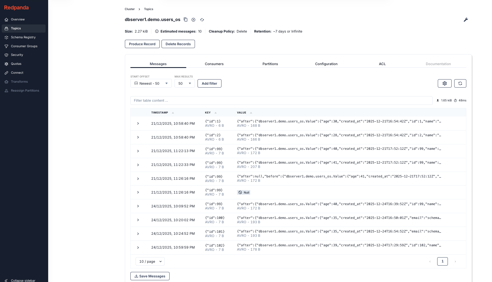

iii) Index in ElasticSearch must **not** update
```
curl http://localhost:9200/dbserver1.demo.users_os/_search\?pretty

curl http://localhost:9200/dbserver1.demo.users_os/_mapping | jq
```
Elasticsearch is schema-on-write + immutable mappings

Once a field appears in an index mapping:
 - It cannot be removed
 - It cannot change type
 - It remains forever for that index

This is by design to guarantee:
 - Segment immutability
 - Query correctness over historical data
 - No silent data corruption

So even if the source database drops a column:
- Elasticsearch keeps the field definition
- New documents simply stop populating it

If Elasticsearch allowed field deletion:
 - Old segments would become invalid
 - Queries on historical data could break
 - Rollbacks would be impossible
 - Time-travel analytics would be unsafe

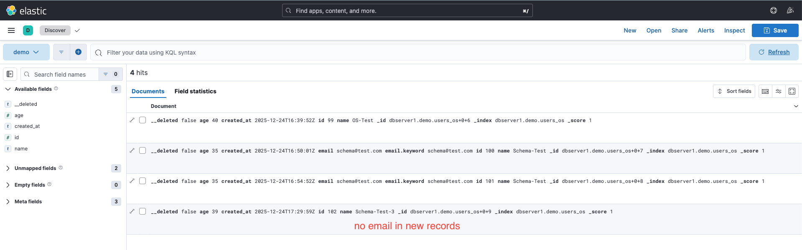

### Ex 3: Schema Evolution (Modify Column Type | DO NOT DO) (Error Example)
As stated in Ex 2, we should create a new version for index in ElasticSearch for handling these kind of column data type modifications.
Here we will continue with the same index as we have enabled `"schema.ignore": true`.

This kind of change should not be done in any production system.

Db Change:
```
ALTER TABLE users_os MODIFY COLUMN age BIGINT;

INSERT INTO users_os VALUES (200, 'Type-Test', 12345678901, NOW());
```

**Validations**

What Happens Internally (Validation Flow)
```
MySQL binlog
   ↓
Debezium parses row
   ↓
Schema history already updated ✔
   ↓
Kafka Connect converter tries to map value schema
   ↓
❌ Incompatible with previous schema
   ↓
Record dropped silently
   ↓
Offset committed
```

Key observations:
 - Every change event was filtered out
 - OR dropped due to conversion / schema incompatibility
 - OR dropped by SMT / schema enforcement
 - The source connector intentionally skipped emitting records
 - No explicit ERROR is raised by Debezium (by design)


i) As we update the data type of field `age` in the table, there should be a new schema registered for this subject.
```
curl http://localhost:8081/subjects | jq

curl http://localhost:8081/subjects/dbserver1.demo.users_os-value/versions | jq

curl http://localhost:8081/subjects/dbserver1.demo.users_os-value/versions/latest | jq
```
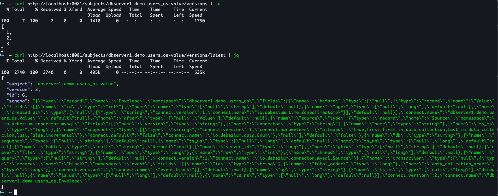

 - age Connect schema changes from INT32 → INT64
 - This creates a new subject version

ii) The ElasticSearch connector task failed due to incompatible record, 
as the new schema will conflict with already registered age as type integer.

Error log:
```
ERROR Encountered an illegal document error. Please check DLQ topic for errors.
To ignore future records like this, change the configuration 
'behavior.on.malformed.documents' to 'IGNORE'.
```

```
ERROR WorkerSinkTask{id=elasticsearch-users-cdc-sink-0} 
Task threw an uncaught and unrecoverable exception.
Task is being killed and will not recover until manually restarted.
```

iii) Source Connector behavior

No new records appear in the source topic however:
 - Debezium read the change
 - Kafka Connect dropped the record
 - Offsets still advanced
```
DEBUG WorkerSourceTask{id=debezium-mysql-users_os-0} 
Either no records were produced by the task since the last offset commit, 
or every record has been filtered out by a transformation or dropped due to transformation or conversion errors.
```

**Why This Is Dangerous in Production**
 - Source connector may silently stop producing data
 - Offsets continue → data loss without alerts
 - Elasticsearch index becomes poisoned
 - Downstream consumers receive partial or inconsistent data

**Correct Approach**

For datatype changes:
 - Create a new version of table(users_os_v2)
 - Then register new Source and Sink connectors which will index and properly pick the new schema.

---
Cleanup

```
curl -X DELETE http://localhost:8083/connectors/elasticsearch-users-cdc-sink

curl -X DELETE http://localhost:8083/connectors/debezium-mysql-users_os

```


